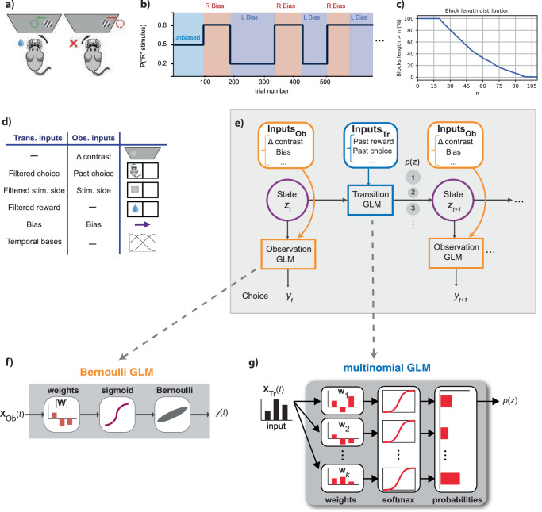
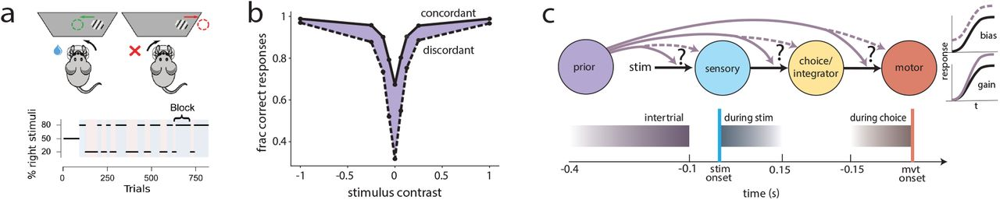
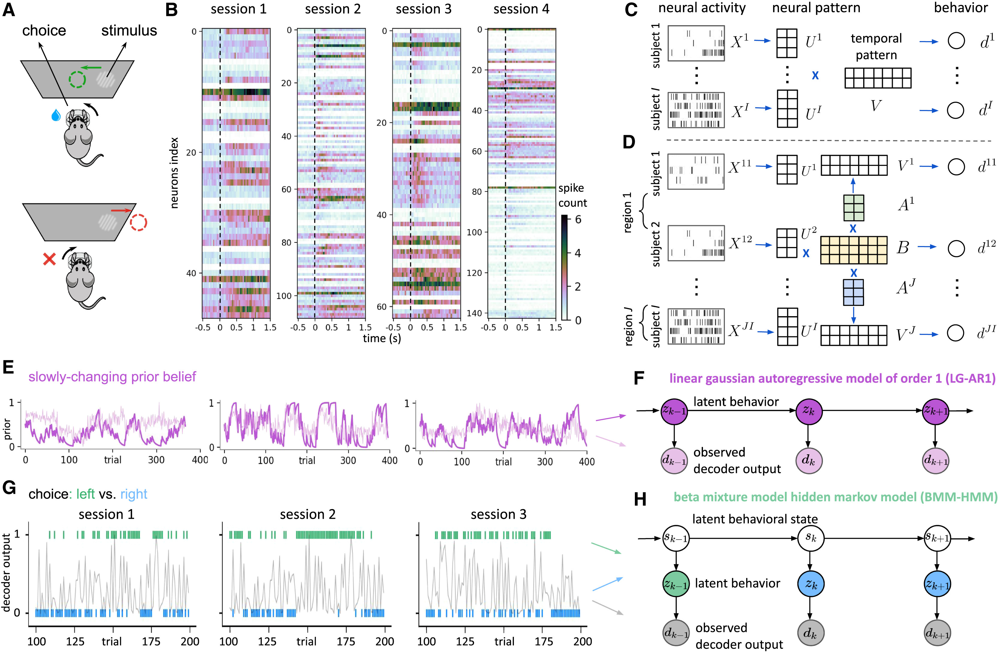
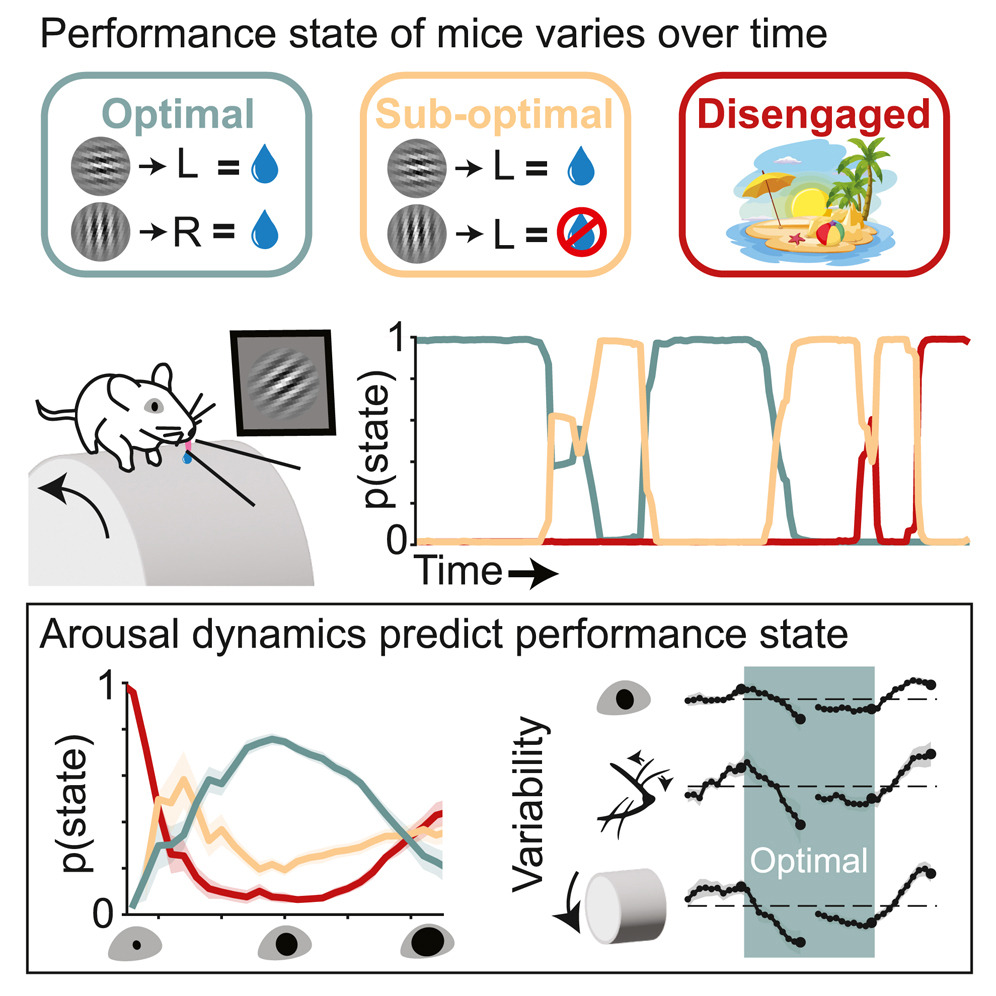
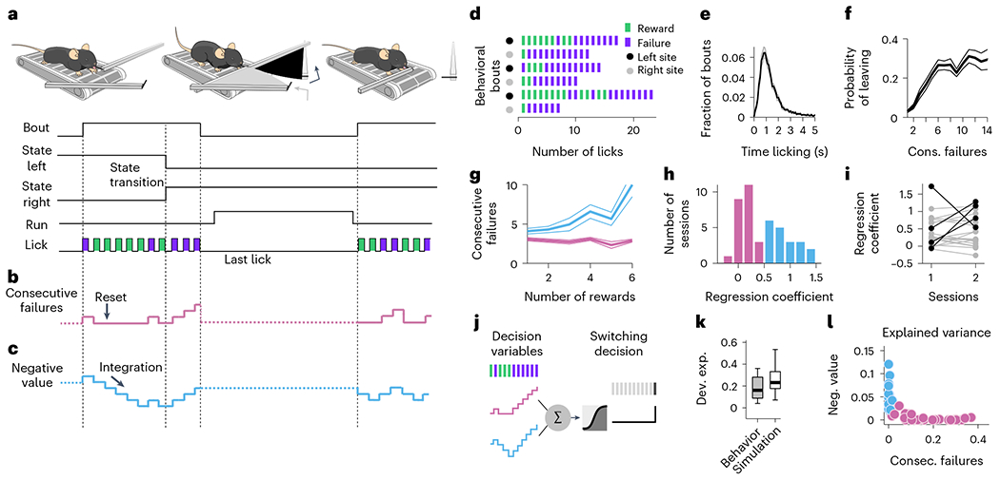

# 先行文献まとめ

[reference/README.md](README.md) の一覧にある14本の先行文献を、1ファイルに集約したものです。論文間・本リポジトリとの関連性は [reference/relations.md](relations.md) を参照してください。

論文PDFを [sources/](sources/) に保存している8本（#1, #2, #3, #4, #6, #7, #8, #12）は個別ファイルがあり、要旨（原文PDFに基づく箇条書き）とモデル定義・メソッドの詳細はそちらに記載しています。ここでは書誌情報と要約のみを示します。PDF未保存の6本（#5, #9, #10, #11, #13, #14）は、この一覧が唯一の情報源です。

---

## 1. Multimodal dataset linking wide-field calcium imaging to behavior changes in operant lever-pull task in mice

*マウスのオペラント・レバー引き課題における広視野カルシウムイメージングと行動変化を結びつけたマルチモーダルデータセット*

Kondo, M. et al. — Scientific Data 12, 1264 (2025). DOI: [10.1038/s41597-025-05482-y](https://doi.org/10.1038/s41597-025-05482-y) — 個別ファイル: [kondo2025_braidynbc_dataset.md](kondo2025_braidynbc_dataset.md)（原本PDFあり）

### 要約

- **問題**
  - 運動学習の神経メカニズム・急速な学習効果・長期適応を調べるには、神経活動・身体運動・環境パラメータを同時かつ長期的に記録したデータセットが必要。
- **手法**
  - 頭部固定マウスのレバー引き課題（2週間・15セッション）を、以下と同時記録:
    - 広視野カルシウムイメージング（大脳皮質全体）
    - 身体・顔・眼球運動ビデオグラフィ（DeepLabCut）
    - レバー位置・報酬・環境パラメータ
  - NWB形式に整形し、FAIR原則に準拠して公開。
- **結果**
  - マウス25匹、375セッション中364セッションでデータ収集に成功。
  - 応答率は訓練を通じて上昇し、DeepLabCut・皮質領域レジストレーションの妥当性を検証済み。

---

## 2. Mice alternate between discrete strategies during perceptual decision-making

*マウスは知覚的意思決定の最中、離散的な複数の戦略を交互に切り替える*

Ashwood, Z. C. et al. (International Brain Laboratory) — Nature Neuroscience 25, 201–212 (2022). DOI: [10.1038/s41593-021-01007-z](https://doi.org/10.1038/s41593-021-01007-z) — 個別ファイル: [ashwood2022_discrete_strategies.md](ashwood2022_discrete_strategies.md)（原本PDFあり）

### 要約

- **問題**
  - 知覚意思決定の古典的解析は、動物が単一で一貫した戦略を使う、あるいは緩やかに進化すると仮定してきた。
  - 離散的に切り替わる複数戦略の混在を検出できる枠組みを提示し、「lapse」現象への代替説明を検証する。
- **手法**
  - IBLの視覚検出課題（Gaborグレーティング、コントラスト0〜100%）のマウス・ヒトデータに、Bernoulli GLMを観測モデルとするGLM-HMMを適用。
  - 4次元デザイン行列（刺激・バイアス・前試行の選択・win-stay-lose-switch）を入力に、5-fold cross-validationで状態数を選択。
- **結果**
  - IBLマウス37匹で3状態が最適。
    - 感覚刺激に強く依存し正答率が高い「Engaged」状態（例示個体で90%）。
    - 刺激依存が弱くバイアスが大きい2つの「Biased」状態（同58〜60%）。
  - 状態は数十〜数百試行持続し、げっ歯類実験で観察される「lapse」現象への代替説明を与える。

---

## 3. Internal states emerge early during learning of a perceptual decision-making task

*知覚的意思決定課題の学習の初期段階から内部状態が出現する*

Cuturela, L. I. et al. (International Brain Laboratory) — bioRxiv preprint (2024). DOI: [10.1101/2024.11.30.626182](https://doi.org/10.1101/2024.11.30.626182) — 個別ファイル: [cuturela2024_internal_states_early.md](cuturela2024_internal_states_early.md)（原本PDFあり）

### 要約

- **問題**
  - Ashwood et al. (2022) のGLM-HMMは、状態内のGLM重み・遷移行列をセッションを通じて固定パラメータとして学習するため、十分訓練された定常状態のデータにしか適用できず、訓練初期からいつ・どのように複数戦略が出現するかという学習過程そのものは扱えない。
- **手法**
  - GLM重みが前セッションの重みを中心としたガウス事前分布に従ってセッション間で緩やかに変化し（ハイパーパラメータαが変化幅を制御）、遷移行列もセッションごとにディリクレ事前分布から生成される（濃度パラメータκが大域行列への近さを制御）「dynamic GLM-HMM」を提案。α→0, κ→∞の極限で静的GLM-HMMと一致する。
  - IBL傘下3施設のマウス32匹について、左右等確率の基本課題からブロック構造のフル課題までの全試行に個体ごとに独立にモデルをフィット。状態数K・変化率αはheld-outデータのcross-validationで選択。
- **結果**
  - 個体・タスク全体でK=3、α≈3が最良となり、Ashwood et al. の3状態という結果と一致。2セッション目の時点で既に3状態モデルが1状態モデルを上回る。
  - 学習の非常に早い段階からEngaged状態と左右2つのBiased状態が併存し、訓練を通じた成績向上は「全状態での刺激感度の増加」と「Engaged状態のoccupancy増加」の組み合わせで説明される。
  - Engaged状態が一定の正答率に達した時点を学習達成と定義する新しい基準を提案し、内部状態の脱従事を考慮しない単純な正答率基準より早期に学習達成と判定されることを示した。

---

## 4. Infinite hidden Markov models can dissect the complexities of learning

*無限隠れマルコフモデルは学習の複雑性を解剖できる*

Bruijns, S. A. et al. (International Brain Laboratory), Dayan, P. — Nature Neuroscience 29, 186–194 (2026年1月号 / 2025年12月30日オンライン公開). DOI: [10.1038/s41593-025-02130-x](https://doi.org/10.1038/s41593-025-02130-x) / [bioRxiv preprint](https://www.biorxiv.org/content/10.1101/2023.12.22.573001) — 個別ファイル: [bruijns2025_infinite_hmm.md](bruijns2025_infinite_hmm.md)（原本PDFあり）

### 要約

- **問題**
  - 課題の随伴性を学習する過程は個体ごとに独特で、探索と適応を繰り返しながら方略を何度も修正する。
  - こうした学習曲線を定量化するには、新しい行動の出現（急な変化）と既存行動の緩やかな適応の両方を捉えられるモデルが必要。
- **手法**
  - 動的な無限隠れセミマルコフモデル（diHMM）を提案。
    - 潜在状態が行動の1コンポーネント（ロジスティック回帰で表される方略）に対応する。
    - 階層ディリクレ過程により状態数を固定せず、既存のどの状態にも当てはまらない急な変化が起きたら新しい状態を導入する（fast process）。
    - 状態ごとのGLM重みはガウシアンランダムウォークでセッション間を緩やかにドリフトする（slow process）。
    - 状態の持続時間は幾何分布ではなく負の二項分布で明示的にモデル化するセミマルコフ構造を採用。
- **結果**
  - IBLの視覚検出課題を学習するマウス134匹（平均24.4セッション、総計>1.9M試行）に適用。
    - ほぼ全個体が3段階（未分化で誤りがちな初期行動→片側のみの部分的理解→左右両方の完全な理解）を経て進行するが、各段階に要するセッション数・状態構成は個体間で大きくばらつく。
    - 新しい状態の導入はセッション開始時に集中しやすい。
    - 学習初期の応答バイアスはその後のバイアスを予測しない。

---

## 5. Identifying the factors governing internal state switches during nonstationary sensory decision-making

*非定常な感覚性意思決定における内部状態切り替えを支配する要因の同定*

Mohammadi, Z., Ashwood, Z. C., Pillow, J. W. — Nature Communications (2025). DOI: [10.1038/s41467-025-66738-0](https://doi.org/10.1038/s41467-025-66738-0)

### 要約

- **問題**
  - マウスは知覚意思決定の際、1セッション内で複数の戦略を切り替えることが知られているが、従来のGLM-HMMは遷移確率を固定パラメータとして扱うため、報酬構造が時間的に変化する非定常な環境下で何が状態遷移そのものを駆動するのかを説明できなかった。
- **手法**
  - 状態依存の選択確率を表すBernoulli GLM（観測GLM）と、状態間の遷移確率を表すmultinomial GLM（遷移GLM）を組み合わせた、入力依存遷移付きGLM-HMMを提案。遷移GLMは遷移元状態ごとのベースライン項と遷移先状態の重みの線形結合で表され、観測GLMとは異なる回帰子集合を用いる点が鍵（観測側は刺激コントラスト・前試行選択・刺激側・バイアス、遷移側は指数フィルタをかけた前試行選択・前刺激側・前報酬、およびセッション冒頭のウォームアップ効果を表す3つの基底関数）。
  - IBLの刺激ブロック課題（無バイアス90試行の後、20:80/80:20の左右バイアスブロックが平均約58試行の長さで無告知に交代）データのうち、複数セッション行ったマウス37匹・数十万試行にMAP+EMで適用し、状態数はheld-outデータのcross-validated log-likelihoodで選択。
- **結果**
  - 4状態モデルが採用され、刺激感度が高くバイアスの弱い2つのEngaged状態（Engaged-L/R）と、刺激感度が低くバイアスの強い2つのBiased状態（Biased-L/R）に分かれた。マウスは自身がいるブロックの偏りに対応する状態を全試行の約72%で優先的に用い、Biased状態でも側バイアスを利用することで高成績を維持していた。
  - 遷移GLMの重みから、前試行の選択・刺激側が左右バイアス状態間の遷移を、前試行の報酬がEngaged/Biased（従事/非従事）間の遷移を予測することが示された。報酬が多いほどBiased（非従事）状態への遷移が起きやすく、満腹（satiety）との関連が示唆された。
  - バイアスブロック開始から対応する側の状態への遷移まで中央値9試行を要し、遷移GLMを含むモデルは含まないモデルより有意に高いheld-out尤度を示した。

---

## 6. Behavioural and neural mechanisms for stochastic choices in mixed-strategy games

*混合戦略ゲームにおける確率的選択の行動・神経メカニズム*

Aloor, J., Sit, T. P. H., Gauld, O. M., Warren, J., Mower, M., Lee, D., Duan, C. A. — bioRxiv preprint (2026). DOI: [10.64898/2026.07.29.741515](https://doi.org/10.64898/2026.07.29.741515) — 個別ファイル: [aloor2026_stochastic_choices.md](aloor2026_stochastic_choices.md)（原本PDFあり）

### 要約

- **問題**
  - 敵対的な相手と競争する場面では、予測可能な選択パターンはむしろ不利になる。動物がどのように確率的で予測不能な選択を神経回路レベルで生成するかは不明だった。
- **手法**
  - 頭部固定マウスに、直前1〜4試行の選択・報酬パターンから次の選択を予測する搾取的なコンピュータ相手とのマッチングペニーゲーム（二者択一のゼロサムゲーム）を訓練。
  - Ashwood et al. (2022) のGLM-HMMを適用し、サイドバイアス・直前の勝ち選択の反復（repeat-win）・直前の負け選択の反復（repeat-loss）を回帰子とする3状態モデル（右バイアス状態・左バイアス状態・確率的状態）で試行ごとの戦略を推定。同じ枠組みをLee et al. (2004) のサルのマッチングペニーデータにも適用し種間で比較。
  - 広視野カルシウムイメージング（背側皮質全体、GCaMP6s）とlocaNMFによる空間成分分解を用いて、GLM-HMMで推定した潜在戦略状態・報酬・選択のデコーディングを実施。
- **結果**
  - マウスは学習に伴い、構造化された（バイアスのある）戦略から、報酬率が理論最適値0.5に近い確率的戦略へと移行した。サルでも共通の確率的状態が同定され、種を超えて共有される戦略であることが示された（ただしセッション内での確率的状態の使い方には種間差がある）。
  - 皮質活動は現在の報酬・選択・直前の報酬・相手の選択を符号化しており、GLM-HMMで推定した潜在戦略状態（確率的状態 vs バイアス状態）も皮質活動から有意にデコード可能だった。
  - 確率的状態では過去の報酬に関する皮質表現が減弱する一方、直近の報酬信号自体は保たれていた。さらに、報酬信号の強さが次の選択（switch/stay）を予測する関係は報酬誘導型の行動では成立するが確率的状態では消失しており、確率的な選択の生成は「報酬情報の喪失」ではなく「報酬信号と将来選択の選択的な分離」によって生じることが示唆された。

---

## 7. Facial expressions in mice reveal latent cognitive variables and their neural correlates

*マウスの表情は潜在的な認知変数とその神経相関を明らかにする*

Cazettes, F. et al. — Nature Neuroscience (2025). DOI: [10.1038/s41593-025-02071-5](https://doi.org/10.1038/s41593-025-02071-5) — 個別ファイル: [cazettes2025_facial_expressions.md](cazettes2025_facial_expressions.md)（原本PDFあり）

### 要約

- **問題**
  - 脳活動が表情に漏れ出すことは知られているが、それが単なる身体の生体力学的連動なのか、真に内部状態（意思決定変数、DV）を反映するのかは判別が難しい。行動報告に直接現れていないDVでも表情に表出されるかを検証できれば、この判別が可能になる。
- **手法**
  - 頭部固定マウスの採食課題（隠れ状態を持つ2つの採食サイト間を移動して舐めて報酬を得る）で、LM-HMM（隠れマルコフモデル×線形回帰、状態ごとに連続失敗数を総報酬数に回帰）により3つの決定方策（Stimulus-bound・Persistent inference・Impulsive inference）を推定。
  - 顔動画のmotion energyにSVDを適用して抽出した動き主成分（movement PC）から、正則化GLM（elastic net、nested cross-validation）で意思決定変数（報酬非依存の推論型変数と報酬依存の刺激拘束型変数）を試行単位で復号し、電気生理記録との比較・二次運動皮質（M2）の光遺伝学的抑制による因果検証を組み合わせる。
- **結果**
  - 現在の戦略で使われていないDVも、他の戦略のエポックをテストセットとした場合に一定の精度で表情から復号でき、同じパワースペクトルを持つ恣意的な信号では復号できないことから、表情がDVそのものを反映することが示された（表情はDVの「貯蔵庫」）。
  - 顔面運動PCは複数の皮質領域（M2・OFC・OC）の神経活動よりも高精度でDVを符号化し、M2の神経表現は表情の変化より約50ms先行していた。
  - M2の両側光遺伝学的抑制により、表情からのDV予測精度が低下しレイテンシが延長したことから、表情に表出されるDVの少なくとも一部がM2由来であることが示された。

---

## 8. Inferring internal states across mice and monkeys using facial features

*顔特徴を用いたマウスとサルにまたがる内部状態の推定*

Tlaie, A. et al. — Nature Communications 16, 5168 (2025). DOI: [10.1038/s41467-025-60296-1](https://doi.org/10.1038/s41467-025-60296-1) — 個別ファイル: [tlaie2025_facial_features_mice_monkeys.md](tlaie2025_facial_features_mice_monkeys.md)（原本PDFあり）

### 要約

- **問題**
  - 内部認知状態（注意・衝動性など）は行動を大きく左右するが、種を超えて共通の実体を持つかは不明だった。
- **手法**
  - VRドーム内でマウス（7匹）とマカクザル（2頭）に同一の視覚採食課題（ターゲット刺激に接近しディストラクタを避ける）を課し、刺激提示前の顔キーポイント（DeepLabCut、マウス9次元・サル18次元）を入力、同じ試行の反応時間（RT）を出力とするMarkov-Switching Linear Regression（MSLR、状態ごとに異なる線形回帰係数を持つ状態空間モデル）を種ごとに学習。
  - 状態数はcross-validated R²のプラトー検出で選択（マウス3状態・サル4状態）。表情の代わりに前試行のRTのみを入力とするAuto-Regressive HMM（ARHMM）を対照として比較。
- **結果**
  - RTのみで学習したモデルが課題成績（正解・誤り・無反応）も予測でき、両種共通して「注意（attentive：速く高成績）」「衝動的（impulsive：速いが誤り多い）」「不注意（inattentive：遅く低成績）」の3プロファイルが得られ、対応する顔特徴パターンにも部分的な重なりが見られた。
  - facial-features版のMSLRは両種・全状態でARHMMを上回り、表情が単なる試行履歴の代理変数ではないことを示した。
  - マカクザルは状態が安定して持続する（遷移行列の対角成分が高い）のに対し、マウスは状態間をより頻繁に遷移するという種差が見られ、サンプル数・特徴数をマッチさせた対照解析でも再現された。

---

## 9. Spontaneous behaviour is structured by reinforcement without explicit reward

*自発行動は明示的な報酬なしに強化によって構造化される*

Markowitz, J. E. et al., Linderman, S. W., Datta, S. R. — Nature 614(7946), 108–117 (2023). DOI: [10.1038/s41586-022-05611-2](https://doi.org/10.1038/s41586-022-05611-2)

### 要約

著者に本リポジトリが使う `ssm` ライブラリの開発者 Scott W. Linderman が含まれる。

- **問題**
  - 課題構造・感覚手がかり・外因性報酬が一切ない自由行動下でも、行動が体系的に構造化されるかは不明だった。
- **手法**
  - マウスの自発的な行動（モーションモジュール列）と背側線条体（DLS）のドパミン変動を同時記録し、光遺伝学的操作で因果性を検証。
- **結果**
  - ドパミン変動は行動モジュールの使用頻度・出現順序を変化させ、後続の行動選択を予測できた。
  - 光遺伝学的操作により、ドパミンが特定の行動モジュールを強化し、行動配列の多様性を増加させることを確認。
  - 強化学習モデルによる解析から、ドパミン変動が報酬信号の代替として機能し、線条体が行動モジュールを動的に組み立てていることが示唆された。

---

## 10. How learned expectations shape brain-wide responses

*学習された期待は脳全体の応答をどのように形作るか*

Liu, A., Schartner, M., International Brain Laboratory, Fiete, I. — bioRxiv preprint (2025). DOI: [10.64898/2025.12.15.694430](https://doi.org/10.64898/2025.12.15.694430)

### 要約

- **問題**
  - 感覚入力から選択・行動生成に至る過程のどこで、いつ、どのように事前知識（prior／期待）による修飾が生じるかは未解明だった。
  - 刺激・選択・事前知識は動物が課題を習得するほど互いに強く相関するため、従来の限定的な記録規模では要因を分離できなかった。
- **手法**
  - IBLの左右2値視覚検出課題（複数試行ブロックで刺激の出現側が偏る）を遂行する訓練済みマウス139匹・脳全体208領域・約60万ニューロンのBrain-Wide Map記録データを使用。
  - 刺激側・選択側・事前知識側の条件付き比較により相関を分離し、各脳領域を「感覚処理」「統合/選択処理」「運動開始」の3機能に分類。
  - 事前知識による修飾を「初期活動バイアス」と「入力ゲイン変調」の2種類に切り分けて領域別・機能クラスタ別に評価。
  - 感覚・統合/選択・運動開始・事前知識の左右対からなる8ノードの力学回路モデル（微分方程式ベース、GLM-HMMではない）を構築し、生理データにフィットさせた上で追加パラメータなしに行動データへ外挿。
- **結果**
  - 感覚処理領域には事前知識による有意な修飾は見られなかった一方、統合/選択領域・運動開始領域はバイアス・ゲインの両方で強く修飾された。
  - 運動開始領域での修飾効果は統合/選択領域より大きいが、力学回路モデルの解析からこれは統合/選択入力の増幅によって受け継がれたものであり、運動開始領域自体への直接的な事前知識効果ではないことが示唆された。
  - 力学回路モデルは生理データへのフィッティングのみで、マウスの心理測定関数・反応時間の行動データを追加のパラメータ調整なしに予測できた。

---

## 11. Exploiting correlations across trials and behavioral sessions to improve neural decoding

*試行間・行動セッション間の相関を活用した神経デコーディングの改善*

Zhang, Y., Lyu, H., Hurwitz, C. ... Pouget, A., Varol, E., Paninski, L. — Neuron 114(3), 536–551.e11 (2026). DOI: [10.1016/j.neuron.2025.10.026](https://doi.org/10.1016/j.neuron.2025.10.026)（bioRxivプレプリント: DOI [10.1101/2024.09.14.613047](https://doi.org/10.1101/2024.09.14.613047)）

### 要約

- **問題**
  - 従来の神経デコーダは単一試行・単一セッション内の神経活動と行動の対応づけに留まり、動物が同じ課題を繰り返す際に生じる試行間・セッション間の相関構造を活用できていなかった。
- **手法**
  - 神経側のモデルとして、低ランク制約付きの多セッション縮小ランク回帰（reduced-rank regression, RRR）を提案。時間方向の基底をセッション間で共有しつつ神経基底はセッションごとに個別推定することで、行動に関連する神経表現をセッションをまたいで学習する（脳領域ごとに時間基底の一部を変えられる多領域版RRR (MR) も提案）。
  - 行動側のモデルとして、連続変数用の一次自己回帰状態空間モデル（LG-AR1、カルマン平滑化で推定）と、二値選択用のベータ混合HMM（BMM-HMM）の2種類の多セッション状態空間モデルを提案。BMM-HMMの隠れ状態遷移はAshwood et al. (2022) のGLM-HMMと同様の枠組みだが、GLM-HMMが行動（選択）そのものをemissionとするのに対し、BMM-HMMは神経活動から推定した単一試行デコーダ出力の系列をemissionとする点が異なる。
  - IBLマウスNeuropixelsデータ（433セッション・270脳領域）を主対象とし、Allen Institute視覚コーディングデータセット・サルのリーチング課題データで手法の汎化性を検証。
- **結果**
  - 提案モデルは選択・事前知識（prior）・車輪速度・ヒゲ運動エネルギーなど複数の行動変数のデコーディング精度で、線形回帰やMLPなどの従来手法を上回った。
  - 深層学習モデルに比べ軽量かつ解釈可能で、学習された神経基底からタスク関連ニューロンを同定でき、領域ごとの時間基底から脳全体の活性化タイムスケール地図を作成できた。
  - BMM-HMMは真の選択やブロック境界を与えずに、神経活動由来の単一試行デコーダ出力の系列のみから潜在的な行動状態（IBL課題では刺激側バイアスに対応する状態）を精度良く推定した。

---

## 12. Decision-making dynamics are predicted by arousal and uninstructed movements

*意思決定のダイナミクスは覚醒度と無指示運動から予測できる*

Hulsey, D., Zumwalt, K., Mazzucato, L., McCormick, D. A., Jaramillo, S. — Cell Reports 43(2), 113709 (2024). DOI: [10.1016/j.celrep.2024.113709](https://doi.org/10.1016/j.celrep.2024.113709) — 個別ファイル: [hulsey2024_arousal_movement.md](hulsey2024_arousal_movement.md)（原本PDFあり）

### 要約

- **問題**
  - 感覚誘導性の意思決定課題では、刺激・報酬の随伴性が一定でも動物のパフォーマンスは複数の状態間を遷移する。この遷移が瞳孔径や無指示運動（顔の動き・移動速度）などの外部から観測可能な指標とどう関係するかは不明だった。
- **手法**
  - 聴覚・視覚それぞれの刺激弁別課題を行うマウスの選択データに、多項分布（左・右・無反応の3択）emissionを持つGLM-HMMを適用。Ashwood et al. (2022) のベルヌーイemission版GLM-HMMを拡張し、無反応試行を明示的なカテゴリとして組み込んだ点が新しい。
  - 各状態のGLM重み（心理測定曲線）から、最適（optimal）・準最適（sub-optimal：左右バイアス、あるいは片側刺激への回避）・離脱（disengaged）の状態プロファイルを分類。
  - 瞳孔径・顔動きエネルギー・移動速度を刺激提示直前の時点でサンプリングし、状態占有確率との関係を回帰・分類器で評価。
- **結果**
  - 13匹のマウス全個体で最適状態・離脱状態が共通して出現し、個体ごとの最適状態数は3〜5。最適状態の滞在時間は準最適・離脱状態より長く維持される。
  - 瞳孔径と最適状態の占有確率の間に、Yerkes-Dodson則と整合する逆U字関係が見られた（聴覚課題と視覚課題で最適瞳孔径のレベルは異なる）。
  - 最適状態では瞳孔径・顔動き・移動速度いずれも試行間変動が縮小し、瞳孔径と運動指標の相関も低下する（覚醒状態の選択的な調節を示唆）。
  - 4状態GLM-HMMは選択の75.7%を正しく予測し、状態遷移を仮定しない1状態モデル（約70%）を有意に上回った。

---

## 13. A reservoir of foraging decision variables in the mouse brain

*マウス脳内における採食意思決定変数の貯蔵庫*

Cazettes, F. et al. — Nature Neuroscience 26(5), 840–849 (2023). DOI: [10.1038/s41593-023-01305-8](https://doi.org/10.1038/s41593-023-01305-8)

### 要約

同グループによる [cazettes2025_facial_expressions.md](cazettes2025_facial_expressions.md)（表情側の報告）と対をなす、神経活動側の報告。

- **問題**
  - マウスは採食課題中に複数の意思決定変数（decision variables, DV）を使い分け、セッション内で戦略を切り替える。この使い分けを支える神経基盤は不明だった。
- **手法**
  - 採食課題中のマウス前頭皮質からニューロン集団活動を記録。
  - 光遺伝学的操作で二次運動皮質（M2）の必要性を検証。
- **結果**
  - M2が異なるDVの使い分けに必要であることが示された。
  - M2の活動は、現在の行動を最もよく説明するDVだけでなく、その時点では使われていない別のDV群も同時に符号化していた。
    - M2は複数タスクに対応可能な計算の「貯蔵庫（reservoir）」を常時保持している。
  - この神経多重化は、学習や環境変化への適応を有利にすると考察されている。

---

## 14. Hidden Markov models reveal behavioral state dynamics in depth-related locomotion in mice

*隠れマルコフモデルはマウスの奥行き関連移動行動における行動状態動態を明らかにする*

Shuto, H. et al. — PLOS ONE 20(8), e0329367 (2025). DOI: [10.1371/journal.pone.0329367](https://doi.org/10.1371/journal.pone.0329367)

### 要約

- **問題**
  - 視覚的な奥行き手がかりに対するマウスの行動応答を、離散的な行動状態として定量化したい。
- **手法**
  - 円形装置と隠れマルコフモデル（HMM）解析を組み合わせ、野生型マウスと網膜変性モデル（rd1-2J）を比較。
- **結果**
  - マウスは奥行き手がかりに応じて「静止（resting）」「探索（exploring）」「移動（navigating）」の3状態間を遷移することが示された。
  - 奥行き知覚には最適な空間周波数帯（6〜8 cm相当）があり、複数の空間手がかりを統合した処理が行われている。
  - 初期の強い崖回避反応が時間とともにより繊細な行動適応へ変化する。
  - 野生型と網膜変性モデルの比較により、これらの行動パターンが視覚処理を特異的に反映することが確認された。
