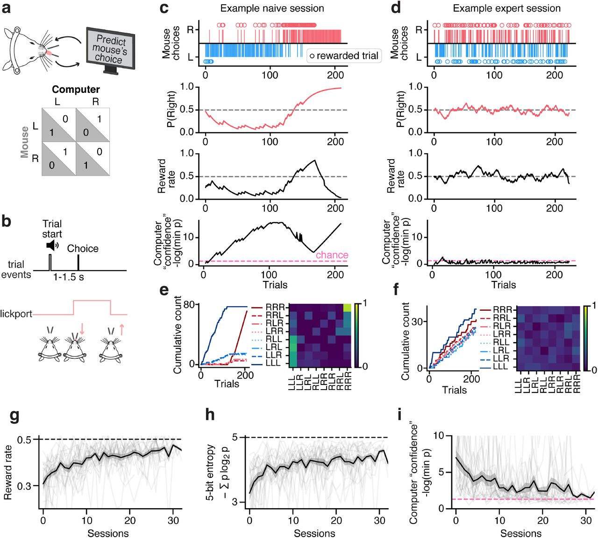

# Behavioural and neural mechanisms for stochastic choices in mixed-strategy games

- **タイトル和訳**: 混合戦略ゲームにおける確率的選択の行動・神経メカニズム
- **著者**: Joanna Aloor, Timothy P. H. Sit, Oliver M. Gauld, Joseph Warren, Matthew Mower, Daeyeol Lee, Chunyu A. Duan
- **誌名**: bioRxiv preprint（2026-08-05投稿版）
- **DOI**: [10.64898/2026.07.29.741515](https://doi.org/10.64898/2026.07.29.741515)
- **リンク**: [bioRxiv](https://doi.org/10.64898/2026.07.29.741515)
- **原本**: bioRxiv preprint（2026-08-05投稿版、Methods章を含む全文）を [reference/sources/](sources/) に保存している。
  - [aloor2026_stochastic_choices_fulltext.pdf](sources/aloor2026_stochastic_choices_fulltext.pdf)（下記「要旨」「モデル定義とメソッド」は全文このPDFに基づく）

## Figure 1

*出典: Aloor et al. (2026) bioRxiv preprint, [10.64898/2026.07.29.741515](https://doi.org/10.64898/2026.07.29.741515)（個人の研究メモ用途での引用）*

## 要旨（原文PDFに基づく）

- **問題提起**
  - 敵対的な相手と競争する場面では、予測可能な選択パターンはむしろ不利になる（相手に読まれる）。動物がどのように確率的で予測不能な選択を神経回路レベルで生成するかは不明だった。
  - 従来の競争課題研究は前頭皮質が報酬・選択履歴や行動価値を表現することを示してきたが、動物が敵対的相手に対して不確実性を保ちながらも意思決定に有用な情報表現をどう両立させているかは未解明。
  - セッション平均の指標では、1セッション内に混在する構造化された（読まれやすい）方策と確率的な方策を区別できない。試行単位で潜在戦略を推定する状態空間モデルが必要。
- **タスク**
  - 頭部固定マウス（行動解析n=22匹、広視野イメージングN=7匹）に、直前1〜4試行の選択・報酬パターンから二項検定で次の選択を予測する搾取的なコンピュータ相手（Barraclough, Conroy, and Lee 2004のAlgorithm 2に準拠）とのマッチングペニーゲーム（二者択一のゼロサムゲーム）を訓練。
  - 聴覚キューでtrial開始、2本のlickportが伸展、マウスは左右いずれかを舐めて選択。コンピュータの予測と異なる選択をした場合のみ報酬（最適戦略は理論的に50%報酬率のランダム選択）。
  - 同じGLM-HMMの枠組みをLee et al. (2004) のマカクザルのマッチングペニーデータ（3種のコンピュータ相手アルゴリズム条件）にも適用し種間比較。
- **数理モデル**
  - Ashwood et al. (2022) のGLM-HMMを適用（定式化は下記「モデルの定義」節）。バイアス・repeat-win（直前の勝ち選択の反復）・repeat-loss（直前の負け選択の反復）の3レグレッサで左右選択確率を状態ごとに予測。
  - 4戦略（サイドバイアス・惰性/perseverance・win-stay/lose-switch・ランダム）のシミュレーションデータでパラメータ回復を検証。
  - leave-one-session-out cross-validationで状態数（1〜5）を選択。比較対象としてロジスティック回帰（Lee et al. 2004式）・強化学習（Q学習）モデルも別途fit。
- **論文固有の要素**
  - 広視野カルシウムイメージング（GCaMP6s、背側皮質全体）を、GLM-HMMで推定した潜在戦略状態のデコード対象として直接使う設計（詳細は下記「モデルの定義」節）。
  - locaNMF（localized non-negative matrix factorisation）で皮質信号を空間局在成分（1匹あたり73〜80個）に分解し、線形SVMデコーダで複数の課題変数（報酬・選択・GLM-HMM状態など）を試行単位でデコード。
- **主要な結果**
  - マウスは学習に伴い、構造化された（バイアスのある）戦略から、報酬率が理論最適値0.5に近い（0.49±0.01）確率的戦略へと移行した。早期セッションは2つのバイアス状態が優勢、後期セッションは確率的状態が優勢という漸進的な遷移が見られた。
  - マカクザルでも共通の確率的状態が同定され、種を超えて共有される戦略であることが示された（ただし状態の使い方には種間差がある）。
  - 皮質活動は現在の報酬・選択・直前の報酬・相手の選択を符号化しており、GLM-HMMで推定した潜在戦略状態（確率的状態 vs バイアス状態）も皮質活動から有意にデコード可能だった。ただし報酬あり試行で学習した状態デコーダは報酬なし試行に汎化せず、状態表現は報酬文脈と絡み合っていた（cross-condition decoding）。
  - 確率的状態では過去の報酬に関する皮質表現が減弱する一方、直近の報酬信号自体は保たれていた。報酬信号の強さが次の選択（switch/stay）を予測する関係は報酬誘導型の行動（biased状態、特に「block switch」試行）では成立するが確率的状態では消失しており、確率的な選択の生成は「報酬情報の喪失」ではなく「報酬信号と将来選択の選択的な分離」によって生じることが示唆された（H2支持）。

## モデルの定義（Methods "GLM-HMM" / "Widefield imaging" / "Widefield decoding" より）

### GLM-HMM本体

Ashwood et al. (2022) のGLM-HMMをそのまま採用。隠れマルコフモデル（遷移行列 $A$、$A_{ij}=P(z_t=j\mid z_{t-1}=i)$）と、各状態内で選択確率を決めるBernoulli GLMの組み合わせ。

- **入力レグレッサ（3次元）**: (1) 一般的なサイドバイアス（定数項）、(2) repeat-win（直前の報酬あり選択の反復。右選択=+1、左選択=-1で符号化）、(3) repeat-loss（直前の報酬なし選択の反復、符号化は同様）。本リポジトリのAshwood 2022デザイン行列4列（Bias/Stimulus/前試行選択/WSLS）と異なり、そもそも感覚刺激（Stimulus）に相当するレグレッサが無い（マッチングペニーゲームは刺激弁別課題ではなく、相手の予測を出し抜くゲームのため）。
- **学習**: 対数尤度最大化のEMアルゴリズム。実装・フィッティング手順はAshwood et al. (2022) に準拠。
- **パラメータ回復の検証**: 既知の固定GLM重みを持つ4つの単一状態戦略（サイドバイアス、惰性、WSLS、ランダム）から生成した4状態HMM（自己遷移確率0.97、4000試行のシミュレーションセッション）で、GLM-HMMが真のパラメータを回復できることを確認。
- **状態数の選択**: leave-one-session-out cross-validation（10通りの乱数初期値、動物ごとに個別）。1状態モデルに正規化したtest log-likelihoodの上昇量を指標に、1〜5状態を比較。
- **CV foldをまたいだ重みの統合（二段階クラスタリング）**: 1つのCV foldにつき10通りの初期値から得られるGLM重みセットを、制約付きk-means（各クラスタが各初期値から1本ずつのサンプルを含むよう制約）でクラスタリングして状態間の対応付けを行い、クラスタ内の中央値を「そのfoldでの代表GLM重み」とする。全CV fold（left-out session）から得られた代表重みを、動物ごとにもう一段階クラスタリングし、その平均を動物の最終的な状態別GLM重みとする。状態事後確率 $P(z_t=k)$ も10通りの初期値の中央値を採用。
- **状態の離散化**: 全ての群間比較・皮質解析で、$P(\text{state})\geq0.8$ を閾値として試行を離散状態（確率的/右バイアス/左バイアス）に割り当てる（Ashwood et al. 2022と同種の閾値処理）。

### 皮質活動への対応付け（Widefield imaging / Widefield decoding）— GLM-HMM状態と皮質活動のリンク方法

1. **撮像・前処理**: GCaMP6sを発現する透過性マウス7匹の背側皮質全体をtandem-lens広視野マクロスコープで撮像（470nm/405nmを交互励光、実効30Hz/チャンネル）。`wfield`パッケージ（Couto et al. 2021）で前処理: 405nmチャンネルを回帰してヘモダイナミックアーチファクトを除去した470nm信号から画素ごとの $\Delta F/F_0$ を計算し、ANTsPyによる相似変換でセッション間・Allen Common Coordinate Framework（CCF）へランドマークベースで位置合わせする。
2. **locaNMFによる次元圧縮**: 動物ごとにセッション連結した広視野データに対しincremental SVD（上位50成分）を行い、それを入力にlocaNMF（Saxena et al. 2020; localization threshold 90%, 脳領域あたり最大rank 3, 最小領域サイズ50px）で空間局在成分に分解。1匹あたり73〜80個のlocaNMF成分が得られる。ピクセル平均・単純SVDより分散説明率・デコード性能の両方で優れることを確認済み（Extended Figure 7）。
3. **デコード対象**: GLM-HMMのdiscrete state（$P(\text{state})\geq0.8$ で離散化、確率的 vs バイアス。左右バイアス状態は統合して単一の「バイアス」クラスにする）に加え、現在の報酬・空間選択・直前報酬・switch/stay選択・相手の選択も同じパイプラインでデコードし比較対象とする。
4. **特徴量の構成**: 最初のlick eventを基準に±1.5秒の窓を取り、0.25秒のtime bin（30fpsに制約された0.03秒刻み）ごとにlocaNMF成分の平均活動を計算し、試行×time binごとの母集団ベクトルを作る。
5. **試行バランシング**: GLM-HMM状態デコードでは、状態とreward（win/loss）の両方を釣り合わせ、各セッション内で確率的/バイアス試行数が等しくなるようサブサンプルする。これは学習段階が進むほど確率的状態のoccupancyが増える（Figure 2f-j）ため、単純にプールすると「学習日による神経活動の変化」と「状態そのものによる神経活動の違い」が交絡することを防ぐ処理。
6. **デコーダ**: $L_2$正則化線形SVM（正則化パラメータ$C=1$）。2-fold cross-validationを20回繰り返した平均デコード精度を報告（block switch状態を含む解析ではデータ数減少のため2-foldのまま試行数を調整）。
7. **cross-condition / cross-window decoding**: ある条件（例: 報酬ありtrial）で学習したデコーダを別条件（報酬なしtrial）でテストする、またはある時間窓で学習したデコーダを別の時間窓でテストする（train time × test timeの行列を作る）ことで、神経コードが条件・時間をまたいで汎化するかを検証する。状態デコーダは報酬あり↔報酬なしの条件をまたいで汎化しなかった（Figure 4l,m）。
8. **d'（識別可能性指数）**: locaNMF成分の時間成分に対し、2条件間の $d' = (\mu_A-\mu_B)/\sqrt{(\sigma_A^2+\sigma_B^2)/2}$ を試行バランシング後に計算し、空間重みで重み付けしてピクセル空間へ逆投影することでd'マップを作る（SVMデコードと相補的な単変量指標）。

### 比較対象モデル

- **ロジスティック回帰**（Lee et al. 2004式）: $\log(P(R)/P(L)) = \beta_0+\sum_{i=1}^{k}\alpha_i c_{t-i}+\sum_{i=1}^{k}\beta_i o_{t-i}$（$c$は自分の過去の選択、$o$は相手の過去の選択、$k=5$、$L_2$正則化 $C=1$）。GLM-HMMとの比較にはAshwood et al. (2022) と同じセッション内5-fold cross-validationを使用（ロジスティック回帰・Q学習モデルはセッションを跨いだheld-out比較に馴染まないため）。
- **強化学習（Q学習）モデル**（Lee et al. 2004式）: 選択確率をソフトマックス $P_R(t)=1/(1+e^{-\beta(Q_R(t)-Q_L(t))})$ で決め、選択した側の価値のみを $Q_{t+1}(c)=Q_t(c)+\alpha \cdot r(c)$（$r(c)$は報酬+1/非報酬-1/非選択0）で更新。パラメータ$(\beta,\alpha_1,\alpha_2)$は最尤推定（L-BFGS-B）。
