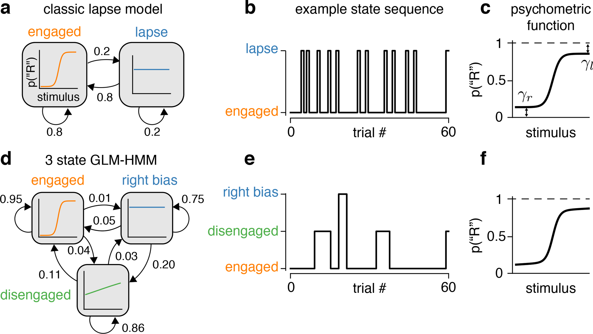

# Mice alternate between discrete strategies during perceptual decision-making

- **著者**: Zoe C. Ashwood, Nicholas A. Roy, Iris R. Stone, International Brain Laboratory, Anne E. Urai, Anne K. Churchland, Alexandre Pouget, Jonathan W. Pillow
- **誌名**: Nature Neuroscience, 25, 201–212 (2022)
- **DOI**: [10.1038/s41593-021-01007-z](https://doi.org/10.1038/s41593-021-01007-z)
- **リンク**: [Nature](https://www.nature.com/articles/s41593-021-01007-z) / [PubMed](https://pubmed.ncbi.nlm.nih.gov/35132235/) / [bioRxiv preprint](https://www.biorxiv.org/content/10.1101/2020.10.19.346353) / [Pillow Lab PDF](https://pillowlab.princeton.edu/pubs/Ashwood2022_NatNeurosci.pdf)

## Figure 1

*出典: Ashwood et al. (2022) Nature Neuroscience, [10.1038/s41593-021-01007-z](https://doi.org/10.1038/s41593-021-01007-z)（個人の研究メモ用途での引用）*

## 要旨（Semantic Scholar 経由で取得した原文の要約訳）

知覚意思決定の古典的モデルは、被験者が単一で一貫した戦略を使う、あるいは戦略が時間とともにゆっくり進化すると仮定してきた。本研究はこの通念が誤りであることを示す新しい解析を提示する。マウスとヒトの意思決定課題データを解析した結果、選択行動が複数の戦略の入れ替わり（interleaved）によって駆動されていることが分かった。これらの戦略は隠れマルコフモデル（HMM）の状態として特徴づけられ、数十〜数百試行にわたって持続したのち切り替わり、しばしば1セッション内で複数回切り替わる。マウス間で一貫して同定された戦略は、感覚刺激に強く依存する単一の「Engaged（従事）」状態と、頻繁に誤答する複数の「Biased（バイアス）」状態だった。この結果は、げっ歯類の行動実験でしばしば観察される「lapse（脱落）」現象に対する強力な代替説明を与え、標準的な成績指標が試行間の大きな戦略変化を覆い隠している可能性を示唆する。著者らは、マウスは lapse するのではなく、持続的な Engaged 状態と Disengaged 状態の間を切り替えると結論づけている。

## この研究との関連

**本リポジトリの GLM-HMM 実装（Ver.3 / Ver.4）が直接準拠する原著論文。**

- [docs/requirements_glmhmm.md](../docs/requirements_glmhmm.md) 冒頭に「採用モデル: Bernoulli GLM-HMM (Ashwood et al., 2022 準拠)」と明記されている。
- README.md の「ライセンス・出典」節で「GLM-HMM は Ashwood et al. (2022) および [ssm](https://github.com/lindermanlab/ssm) の Input Driven Observations に準拠します」と述べている。
- 本研究の RQ1（[docs/RQ.md](../docs/RQ.md)）「内部状態（Engaged vs Random）の生物学的妥当性」は、この論文が定義した Engaged/Biased 状態の枠組みをそのまま踏襲している。
- ssm ライブラリ（`lindermanlab/ssm`）の Input Driven Observations 実装は、この論文の著者グループ（Pillow Lab / Linderman Lab）が公開したもの。
