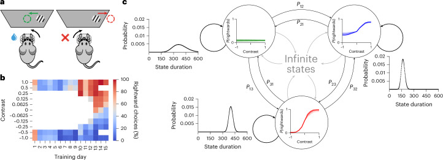

# Infinite hidden Markov models can dissect the complexities of learning

- **タイトル和訳**: 無限隠れマルコフモデルは学習の複雑性を解剖できる
- **著者**: Sebastian A. Bruijns, International Brain Laboratory, Kénia Bougrova, Inês C. Laranjeira, Petrina Y. P. Lau, Guido T. Meijer, Nathaniel J. Miska, Jean-Paul Noel, Alejandro Pan-Vazquez, Noam Roth, Karolina Z. Socha, Anne E. Urai, Peter Dayan
- **誌名**: Nature Neuroscience, 29, 186–194（2025年12月30日オンライン公開 / 2026年1月号）
- **DOI**: [10.1038/s41593-025-02130-x](https://doi.org/10.1038/s41593-025-02130-x)
- **リンク**: [Nature](https://www.nature.com/articles/s41593-025-02130-x) / [bioRxiv preprint](https://www.biorxiv.org/content/10.1101/2023.12.22.573001) / [解析コード（GitHub）](https://github.com/SebastianBruijns/diHMM)
- **原本**: 出版版フルテキスト（Methods・References・Extended Data Fig. 1・Reporting Summaryを含む）と、Supplementary Information（Supplementary Results・Supplementary Figures 1–16・Supplementary Table 1）を [reference/sources/](sources/) に保存している。
  - [bruijns2025_infinite_hmm_fulltext.pdf](sources/bruijns2025_infinite_hmm_fulltext.pdf)（下記「モデルの定義」節は主にこのPDFのMethods章に基づく）
  - [bruijns2025_infinite_hmm_supplement.pdf](sources/bruijns2025_infinite_hmm_supplement.pdf)（変数の記法一覧はSupplementary Table 1、モデル変数の視覚化はSupplementary Fig. 2に基づく）

## Figure 1

## 要旨（原文PDFに基づく）

- **問題提起**
  - 課題の随伴性を学習する過程は個体ごとに独特で、探索と適応を繰り返しながら方略を何度も修正する。こうした学習曲線を定量化するには、新しい行動の出現（急激な変化）と、既存行動の緩やかな適応（漸進的な変化）の両方を捉えられるモデルが必要。
  - 従来の行動獲得研究の多くは、課題の基本を「学習し終えた」時点以降の定常的な振る舞いのみを対象としており、動物1個体につき学習曲線1本しか取れない学習初期段階は個体差が大きく扱いにくいため、あまり研究されてこなかった。
  - 先行するHMM/GLM-HMMアプローチ（Ashwood et al. 2022など）は、状態数を事前に固定し行動の複雑さを一定と仮定するため、訓練を通じて変化する複雑さの進行を捉えにくい。GLMの重みを動的に更新する先行アプローチ（Roy et al. 2021）は単一状態しか扱えず、新規行動の出現（再発の可能性を含む）を表現できない。
- **タスク**
  - International Brain Laboratory (IBL) の視覚検出課題（Ashwood et al. 2022と同一のIBL標準課題）。頭部固定マウスに、左右いずれかにランダムに提示されるコントラスト付きのGaborグレーティングを見せ、ステアリングホイールを回して正しい側へ中央寄せさせる（60秒以内）。正答で水報酬、誤答で音のノイズバースト＋1秒タイムアウト。
  - マウス134匹（IBLプロトコルで収集、C57BL/6J、生後3–7か月）を対象に、シェイピングプロトコルによる学習初期（1セッション目）から解析。1匹あたり平均24.4セッション（総計>3,200セッション、総計>1.9M試行）。
  - シェイピング: 開始時は知覚的難度なし（100%・50%コントラストのみ）。両コントラストで80%正答（50試行基準）に達すると25%コントラストを追加。以降、残りのコントラストセット（12.5%、6.25%、0%）を段階的に追加し、0%コントラストは50%の確率でのみ提示。誤答した直後と同じ刺激を再提示しやすくするデバイアシングプロトコルあり（低報酬率<50%を防ぐ）。
- **数理モデル**
  - 動的な無限隠れセミマルコフモデル（dynamic infinite hidden semi-Markov model; diHMM）を提案。各潜在状態は行動の1コンポーネント（1つの心理測定関数=PMFで特徴づけられる方略）に対応し、状態ごとのロジスティック回帰（Bernoulli GLM）が刺激・履歴・バイアスから選択確率を予測する（定式化は下記「モデルの定義」節）。
  - 標準的なHMM/GLM-HMMを2方向に拡張し統合:
    - **fast process（状態の新規導入）**: 階層ディリクレ過程（Beal, Ghahramani & Rasmussen 2002; GEMプロセスによるstick-breaking）にもとづくベイズ・ノンパラメトリック構造により、既存のどの状態にも当てはまらない急な行動変化が起きたときに新しい状態を導入できる。状態数を事前に固定しない。
    - **slow process（状態内の緩やかな変化）**: 各状態のGLM重みが、ガウシアンランダムウォーク事前分布のもとでセッション境界ごとに緩やかにドリフトする（Roy et al. 2021の動的ロジスティック回帰の考え方を、複数状態を持つHMMに統合）。
  - 標準HMMと異なり、状態の持続時間は幾何分布ではなく負の二項分布で明示的にモデル化するセミマルコフ構造を採用（自己遷移を禁止し、データ拡張スキームでリサンプリング）。これにより持続時間分布をより柔軟に表現できる。
  - 推論はGibbsサンプリングによるMCMC（Pólya-Gamma data augmentationでロジスティック回帰重みを、forward-filter backward-sample法で状態ごとの動的重み系列 $\mathbf{w}_n$を、標準的なHMMの機構で状態割り当て・遷移ベクトル・持続時間パラメータをそれぞれリサンプル）。上限状態数 $L=15$のweak-limit近似で無限過程を近似。
- **決定方策・論文固有の要素**
  - ロジスティック回帰の入力特徴は4次元: 左コントラスト・右コントラスト（別々の重みでtanh圧縮、 $P=5$）、前試行までの選択履歴を指数重み付けした「粘着性（perseveration）」regressor（減衰定数0.25）、バイアス項。IBLタスクでは報酬情報を使うwin-stay-lose-switch regressorは交差検証上のメリットがなく採用していない。
  - 状態のPMF形状を、easy trial（コントラスト100%・50%）での報酬率にもとづき3類型に客観分類: Type 1（平坦、報酬率<60%、感覚刺激に無反応）、Type 2（片側のみ調整、報酬率60–78%、左右非対称）、Type 3（左右完全調整、報酬率≥78%）。
  - 学習の3段階（Stage）を、動物がその時点までに到達した最も高いType（の使用割合が過半数を占めるようになった時点）で定義。
- **主要な結果**
  - マウス134匹の解析で、学習はほぼ全個体で3つの明確な段階（未分化で誤りがちな初期行動→片側のみの部分的理解→左右両方の完全な理解）を経て進行するが、各段階に要するセッション数・使用する状態の構成（個体あたり状態数は中央値6–8）は個体間で大きくばらつく。
  - 新規状態の導入（fast process）はセッション開始時に集中して起きやすく、訓練が進むにつれて頻度が減少する。感覚感度（コントラストへの重み）はfast/slow双方の過程で有意に変化するのに対し、バイアス重みは主にfast process（状態の切り替わり）でのみ変化し、同一状態内でのslow processではほぼ一定に保たれる。粘着性（perseveration）の重みは学習を通じて一貫して小さな役割にとどまる。
  - 個体が各学習段階に要するセッション数の間には相関がほとんどなく（Stage1–2間: Pearson's $r=0.21$、Stage1–3間: $r=0.04$、Stage2–3間: $r=0.14$）、学習初期のバイアス方向は後続段階のバイアス方向を予測しない。
  - モデルは状態数の上限や事前分布のハイパーパラメータ（$\sigma$、持続時間分布の $r$の範囲、 $\alpha$・ $\gamma$の事前分布）に対して頑健で、交差検証・アブレーション実験・生成モデルからのリカバリー実験・posterior predictive checkによって妥当性が確認された（実際の行動より正答率をわずかに過大評価する傾向はあるが、これは主にコントラストのtanh変換に由来する既知のバイアス）。

## モデルの定義（Methods より）

**変数の記法**（Supplementary Table 1）: セッション数を $N$、セッション $n$内の試行数を $T_n$、MCMCサンプル数を $J$、モデル内の状態数を $L$（weak-limit近似の上限）、あるセッション内で実際に使われた状態数を $S$とする。セッション $n$内の $s$番目に使われた状態を $z_{n,s}\in\{1,\dots,L\}$、試行 $t$がどの状態カウンター $s$に属するかを $x_{n,t}=z_{n,s}$で表す。

**階層ディリクレ過程による状態遷移構造**（式2–7）:

- 全体の状態出現頻度を表すベース測度 $\boldsymbol{\beta}\sim\mathrm{GEM}(\gamma)$（GEMはGriffiths–Engen–McCloskeyにちなむ、無限個の要素上の確率ベクトルを生成するstick-breaking過程）。濃度パラメータ $\gamma$が実質的に使われる状態数を決め、 $\gamma\sim\mathrm{Gamma}(0.01,0.01)$という緩い事前分布のもとでこれ自体も推論対象になる。
- 各状態 $i$の遷移ベクトル $\boldsymbol{\pi}_i\sim\mathrm{DP}(\alpha,\boldsymbol{\beta})$、 $i=1,\dots,L$（$\alpha\sim\mathrm{Gamma}(0.01,0.01)$）。 $\boldsymbol{\beta}$が全体の状態人気度を、 $\alpha$が個々の遷移ベクトルがどれだけ $\boldsymbol{\beta}$に近いかを制御する。
- 初期状態分布 $\boldsymbol{\pi}_0\sim\mathrm{GEM}(3)$（濃度3。セッション開始時に新状態が始まりにくいよう、既存状態からのバイアスをやや強めている）。
- 推論では無限過程の代わりにweak-limit近似（上限 $L=15$）を用い、式(2)–(4)が式(5)–(7)のような $L$次元ディリクレ分布に帰着する: $\boldsymbol{\beta}\sim\mathrm{Dir}(\gamma/L,\dots,\gamma/L)$、 $\boldsymbol{\pi}_i\sim\mathrm{Dir}(\alpha\beta_1,\dots,\alpha\beta_L)$、 $\boldsymbol{\pi}_0\sim\mathrm{Dir}(3/L,\dots,3/L)$。実データでは12状態しか使われず、 $L=15$で十分。

**セッション内の遷移とセミマルコフ構造**（式8–15）:

- セッション $n$内の状態系列: $z_{n,1}\sim\boldsymbol{\pi}_0$、 $z_{n,s}\sim\boldsymbol{\pi}_{z_{n,s-1}}$（$s$はセッション内の状態カウンターであり試行番号ではない）。
- 自己遷移を禁止し（データ拡張が必要な理由）、各状態の持続時間は幾何分布ではなく負の二項分布から生成: $r_i\sim U(5,6,7,\dots,704)$、 $p_i\sim\mathrm{Beta}(1,1)$、 $d_{n,s}\sim\mathrm{NB}(r_{z_{n,s}},\,p_{z_{n,s}})$。 $r$の下限を5に設定することで、実験者が提示する左右刺激パターンのごく短周期な統計ではなく、より長く持続する状態を捉えるようにしている。
- 状態は指定された持続時間だけアクティブであり続け、その間は同一状態が観測を生成する: $t_n(s)=\sum_{k<s}d_{n,k}$（状態 $s$が開始する試行番号）、 $x_{n,\,t_n(s)+1:t_n(s)+d_{n,s}}=z_{n,s}$。
- 観測モデル（ロジスティック回帰）: $P(y_{n,t}=R)=\mathrm{sig}(\mathbf{f}_{n,t}\times\mathbf{w}_{x_{n,t},n})$。 $y_{n,t}\in\{L,R\}$は試行 $t$の選択、 $\mathbf{f}_{n,t}$は入力特徴、 $\mathbf{w}_{x_{n,t},n}$はその試行で使われている状態のセッション $n$時点での重み。

**入力特徴（Methods「Dynamic logistic regression prior and sampling」節）**:

- 左コントラスト・右コントラストを別々の重みとして分離（左右で刺激への感度が異なりうるため）。実コントラスト $c$を $\hat{c}=\tanh(pc)/\tanh(p)$（$p=5$）で変換し、0%・6.25%・12.5%・25%・50%・100%を $(0,\,0.302,\,0.555,\,0.848,\,0.987,\,1)$へ写像することで、心理物理的な知覚しやすさの違い（50%と100%はほぼ等しく知覚されるが実数値は2倍差）を反映する。
- 履歴依存の「粘着性（perseveration）」regressor: 過去の選択を指数重み付けした和 $\frac{1}{Z}\sum_{k=1}^{m-1}\exp(-0.25k)(2y_{n,m-k}-1)$（$Z$は正規化定数、減衰定数0.25はクロスバリデーションで選択、 $2y-1$は左を $-1$・右を $+1$に符号化）。報酬情報を使うwin-stay-lose-switch regressorは交差検証上の改善がなく不採用。
- バイアス項（定数1）。

**状態内の重みの動的更新（slow process）**（式16–17）: 各状態 $s$の重み系列 $\mathbf{w}_n$は、初期分布 $\mathbf{w}_1\sim\mathcal{N}(0,8I)$ から、セッション境界ごとにガウシアンランダムウォーク $\mathbf{w}_{n+1}\sim\mathcal{N}(\mathbf{w}_n,\sigma I)$ に従って緩やかに変化する（交差検証で選ばれた segment間分散 $\sigma=0.04$）。あるセッションでその状態が使われなかった場合、重みは次の遷移まで固定される（長い不在期間中に重みが急激に変化するのを防ぐ）。

**推論（Gibbsサンプリング）**:

- ロジスティック回帰重みの推論にはPólya-Gamma data augmentationを用いる（二項尤度で共役事前分布が取れない問題を回避）。まず擬似観測 $\omega_n\sim\mathrm{PG}(b_n,\psi_n)$（$\psi_n=\mathbf{f}_n\times\mathbf{w}_n$、 $b_n$はそのセッション内でその特徴の組み合わせが観測された回数）をサンプルし、次に擬似観測 $\kappa_n=a_n-b_n/2$（$a_n$は右選択の回数）を用いて $\kappa_n/\omega_n\sim\mathcal{N}(\psi_n,1/\omega_n)$ とみなし、forward filter backward sample（カルマンフィルタに基づく）で $\mathbf{w}_n$の系列全体を一括更新する。
- その他の変数（状態割り当て・遷移ベクトル・持続時間パラメータ）は共役事前分布のもとで標準的なHMM/HDP-HMMのGibbs更新則に従う。
- 実行設定: 16本のMCMCチェーンでチェーンあたり48,000サンプルを生成し、最初の4,000サンプルをburn-inとして破棄。収束は $\hat{R}$（fold化・rank-normalize化した変種を含む）で評価し、収束不良の個体12匹を除外。ハイパーパラメータは population全体でのクロスバリデーション（10-fold、held-out log-likelihood）により選択: 持続時間の粘着性減衰定数=0.25、 $\sigma=0.04$、 $r_i\sim U(5,6,\dots,704)$、 $\alpha,\gamma\sim\mathrm{Gamma}(0.01,0.01)$。

**サンプルの集約とクラスタリング（ラベルスイッチング問題への対処）**: 複数のMCMCサンプル・複数チェーンにまたがる状態のラベルスイッチングと等価性に対処するため、各試行対 $(t,m)$が同一サンプル内で同一状態に割り当てられているかを表す共起行列 $C^j_{t,m}=\mathbb{1}(x_t=x_m)$を各サンプル $j$で計算し、それらを平均・Wasserstein距離で修正した行列 $C^{j}_{t,m}= \sum_{i=1}^{L}1- |p^j_{t,i}-p^j_{m,i}| $（ $p^j_{t,i}$はビン $t$内で状態 $i$に割り当てられた試行の割合）をもとに主成分分析・混合ガウス密度推定でモードを同定し、モード内で階層的クラスタリング（距離0.95で打ち切り）を行うことで、最終的な「状態」の集合とその心理測定関数（PMF）を復元する。

**状態のType分類**: 各状態のPMFを、easy trial（コントラスト100%・50%）における報酬率にもとづき3類型に分ける。報酬率<60%をType 1（平坦）、60–78%をType 2（片側のみ調整。さらに100%左コントラストでの誤答率と100%右コントラストでの誤答率の差が10ポイント未満なら「symmetric」）、≥78%をType 3（左右完全調整）とする。動物がその時点までに到達した最も高いTypeの使用割合が過半数になったセッションをもって、Stage（1→2→3）が進行したと定義する。
