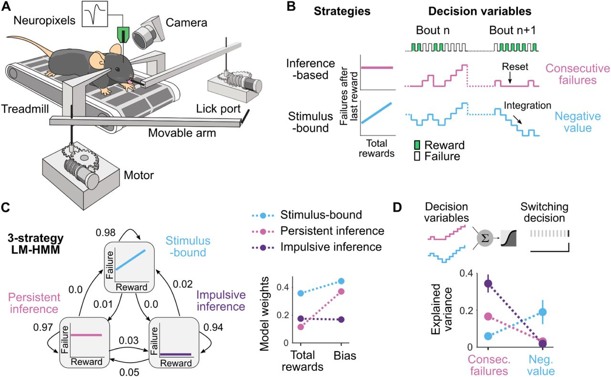

# Facial expressions in mice reveal latent cognitive variables and their neural correlates

- **タイトル和訳**: マウスの表情は潜在的な認知変数とその神経相関を明らかにする
- **著者**: Fanny Cazettes, Davide Reato, Elisabete Augusto, Alfonso Renart, Zachary F. Mainen
- **誌名**: Nature Neuroscience (2025)（プレプリント: bioRxiv, 2024-06-02投稿）
- **DOI**: [10.1038/s41593-025-02071-5](https://doi.org/10.1038/s41593-025-02071-5)
- **リンク**: [Nature](https://www.nature.com/articles/s41593-025-02071-5) / [PubMed](https://pubmed.ncbi.nlm.nih.gov/41028294/) / [bioRxiv preprint](https://www.biorxiv.org/content/10.1101/2024.06.02.597005)
- **原本**: bioRxiv preprint v1（2024-06-02投稿版、出版版と同じタイトル・著者）を [reference/sources/](sources/) に保存している。
  - [cazettes2025_facial_expressions_biorxiv_v1.pdf](sources/cazettes2025_facial_expressions_biorxiv_v1.pdf)（下記「要旨」「モデルの定義とメソッド」は全文このPDFに基づく）

## Figure 1

*出典: Cazettes et al. (2025) Nature Neuroscience, [10.1038/s41593-025-02071-5](https://doi.org/10.1038/s41593-025-02071-5)（bioRxivプレプリント版より取得。個人の研究メモ用途での引用）*

## 要旨（原文PDFに基づく）

- **問題提起**: 脳活動が刺激応答や内部状態を身体（表情など）にリークさせることは広く知られている。しかし、その表情が「身体の生体力学的な結合によって課題関連反応と連動しているだけ」なのか「真に内部状態を反映している」のかを判別することは難しい。本研究は、神経的には計算されているが**その時点では課題行動に直接現れていない**意思決定変数（DV）と表情の関係を計測することで、この判別を可能にした。相関（電気生理記録）と因果（光遺伝学）の両方でこれを検証している。
- **タスク**: 頭部固定したマウスがトレッドミル上で2つの採食サイト（可動アーム）間を移動し、舐めて糖水報酬を得る採食課題（Cazettes et al. 2023 と同一）。各サイトの「報酬あり／枯渇」状態は隠れ状態で、舐めるたびに0.9の確率で報酬が出て、0.3の確率で状態が報酬あり→枯渇へ遷移する（枯渇→報酬ありへの逆遷移はない）。
- **マウスの決定方策（意思決定変数, DV）**: サイトを離れるタイミングを決める2つの方略を仮定。
  - **Consecutive Failures（CF、推論型）**: 報酬非依存。連続失敗数をカウントし、報酬が出るとリセットされる。
  - **Negative Value（VAL、刺激拘束型）**: 報酬依存。報酬の累積に応じて増減する、サイトの正味負の価値。報酬が出るたびに1減る（失敗のたびに蓄積）。
- **数理モデル（LM-HMM、戦略数の決定）**: 隠れマルコフモデル（HMM）と線形回帰（LM）を組み合わせた LM-HMM で、連続失敗数を説明する隠れ状態（＝戦略）を推定。3-fold cross-validation・最尤推定（MLE）・最大事後確率推定（MAP）を用いて状態数を3に決定（詳細は下記「モデルの定義」節）。
- **戦略とDVの対応検証**: 各戦略エポック内で、CFとVALを予測変数とする正則化ロジスティック回帰モデルを用い、各舐め行動がボウトの最後の舐めになる確率（＝サイトを離れる確率）を予測。DV間の説明力（分散説明率、精度0〜0.4程度）を比較し、CFが推論型戦略を、VALが刺激拘束型戦略をそれぞれよく説明することを確認した。
- **表情からのDV復号（相関的検証）**: 顔動画のmotion energyにSVDを適用し、動き主成分（movement PC、N=100、顔全体・上顔・体の3領域）を抽出。舐めイベント周囲200msビンで、交差検証・正則化GLMによりDVを試行単位で予測できることを示した。DVを行動結果や互いに直交化した「unique」成分でも復号可能で、同じパワースペクトルを持つ恣意的な信号は復号できないことから、表情が単なる運動の副産物ではなくDVそのものを反映することを確認。顔領域ごとの重みで動き分布を可視化すると、DVごとに特徴的な部位（例: VALは鼻周辺、CFはより微細なパターン）が一貫して見られた。
- **戦略非依存性の検証**: 各戦略エポックを個別のテストセットとして使い、そのエポック内の顔面運動PCから他の戦略のDVを予測できるかを検証。結果、DVの復号精度は現在使用中でない戦略のDVに対しても戦略に依存せず一定であり、「今使っていないDVも顔に表出され続けている」ことを示した（＝表情はDVの「貯蔵庫（reservoir）」を反映する）。
- **表情 vs 神経活動の比較**: 舐め時刻からの時間ラグを振ったスライディングウィンドウ（200ms窓、75%オーバーラップ）で、顔面運動PCおよび複数皮質領域（M2・OFC・OC）の神経活動それぞれからGLMでDVを予測し、精度とレイテンシを比較。顔面運動PCは全脳領域よりも高い精度でDVを符号化したが、レイテンシではM2の神経表現が顔の表情より約50ms先行していた（OFC・OCは逆に顔より遅れて出現）。
- **M2の因果的検証（光遺伝学）**: VGAT-ChR2マウスでM2を両側光遺伝学的に抑制（ランダムに選んだ30%のボウトで実施）すると、顔面運動PCからのDV予測精度が低下し、レイテンシが延長した。以上より、表情に表出されるDVの少なくとも一部がM2由来であることを示した。

## モデルの定義とメソッド（Methods "LM-HMM" / "Data Analyses" より）

**LM-HMM（隠れマルコフモデル×線形回帰）**: 舐めボウト系列 $t=1,\dots,T$ に沿って、正規化した連続失敗数 $\hat F_t$（観測）を正規化した総報酬数 $\hat R_t$（入力）に対する時間変化する線形回帰としてモデル化する。

$$\hat F_t = w^{(k)} \hat R_t + b^{(k)} + \epsilon_t,\qquad \epsilon_t \sim \mathcal{N}(0, \sigma^{(k)})$$

- 正規化: セッション $m$ ごとに $\hat F_t = F_t / F_m^{max}$、$\hat R_t = R_t / R_m^{max}$（min-max、0〜1に収める）とし、全セッションに単一モデルを当てはめられるようにする。
- 傾き $w^{(k)}$・切片（バイアス）$b^{(k)}$・ノイズ分散 $\sigma^{(k)}$ が隠れ状態 $k=1,\dots,K$ に依存する。$w^{(k)}=0$ は推論型（報酬非依存＝CF）、$w^{(k)}>0$ は刺激拘束型（報酬依存＝VAL寄り）の戦略を表す。$b^{(k)}$ が大きいほど「多くの失敗を許容してから離れる」＝低衝動性（persistent）、小さいほど高衝動性（impulsive）。
- 全マウスのデータにEMアルゴリズムでパラメータをフィットし、3-fold cross-validation（MLE + MAP）でモデル複雑度（状態数 $K=3$）を選択。得られた3状態は "Stimulus-bound"（自己遷移確率0.98）・"Persistent inference"（0.97）・"Impulsive inference"（0.94）と解釈された。

**表情からのDV復号（GLM）**: 顔面movement PC（またはニューロン活動）を予測変数、DV（正規分布を仮定）またはスイッチ行動（ベルヌーイ分布のGLM）を目的変数とする一般化線形モデル。過学習を避けるため、nested cross-validationとelastic net正則化（$\alpha=0.5$、最小lambdaでハイパーパラメータ選択）を使用。予測性能はさらに5-fold cross-validationで評価し、決定係数（$R^2$）を交差検証済み予測から算出する。

**時間ラグ解析**: ニューロン・movement PCそれぞれについて、舐め時刻を基準に200msスライディングウィンドウ（75%オーバーラップ）でラグ系列を作成し、各ラグでのDV復号精度を独立にGLM評価。レイテンシは、精度曲線のピーク付近で最小値と最大値の中点に対応する遅延として定義する。