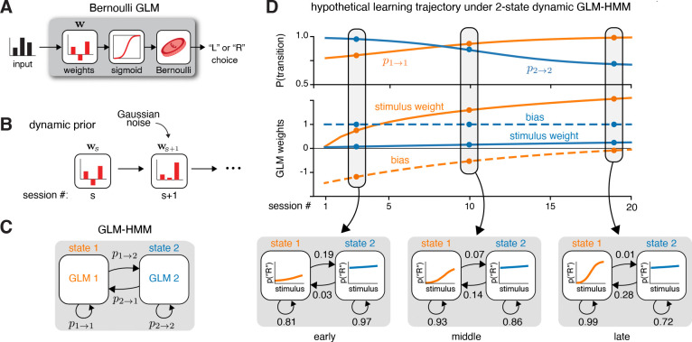

# Internal states emerge early during learning of a perceptual decision-making task

- **タイトル和訳**: 知覚的意思決定課題の学習の初期段階から内部状態が出現する
- **著者**: Lenca I. Cuturela, International Brain Laboratory, Jonathan W. Pillow ほか
- **誌名**: bioRxiv preprint（2024年12月投稿）
- **DOI**: [10.1101/2024.11.30.626182](https://doi.org/10.1101/2024.11.30.626182)
- **リンク**: [bioRxiv](https://www.biorxiv.org/content/10.1101/2024.11.30.626182) / [PubMed](https://pubmed.ncbi.nlm.nih.gov/39651276/)
- **原本**: bioRxiv preprint v2（2025-09-10投稿版、全文）を [reference/sources/](sources/) に保存している。
  - [cuturela2024_internal_states_early_biorxiv_v2.pdf](sources/cuturela2024_internal_states_early_biorxiv_v2.pdf)

## Figure 1

*出典: Cuturela et al. (2024) bioRxiv preprint, [10.1101/2024.11.30.626182](https://doi.org/10.1101/2024.11.30.626182)（個人の研究メモ用途での引用）*

## 要旨（原文PDFに基づく）

- **問題提起**
  - [ashwood2022_discrete_strategies.md](ashwood2022_discrete_strategies.md) のGLM-HMMは、十分訓練された（定常状態に達した）マウスのデータに対して複数の離散戦略を検出できる。
    - しかし、状態内のGLM重み・遷移確率をセッションを通じて固定パラメータとして学習するため、学習過程そのもの（訓練初期からいつ・どう複数戦略が出現するか）は扱えない。
  - 本研究はこの限界を克服する動的モデルを開発し、動物が訓練開始時から複数戦略を切り替えるのか、十分な曝露後にのみそうなるのかを検証する。
- **タスク**
  - IBLの2値強制選択視覚課題。左右いずれかにサイン波グレーティング刺激（コントラスト0〜100%）が提示され、マウスはホイールを回してどちら側かを報告する。
  - 訓練は2段階:
    - まず左右等確率（50:50）の基本課題。
    - 次に左右一方に偏ったブロック構造（20:80 / 80:20が試行ブロックごとに交代）のフル課題。
  - IBL傘下3施設の32匹について、基本課題〜フル課題を通した全試行に個体ごとにモデルを独立にフィットしている。
- **数理モデル（dynamic GLM-HMM）**
  - GLM-HMMを「学習過程」へ拡張したモデル（定式化は下記「モデルの定義」節）。
    - GLM重みがセッション間で前セッションの重みを中心としたガウス事前分布に従って緩やかに変化できる。
    - 遷移行列もセッションごとにディリクレ事前分布から生成される。
  - これにより、静的GLM-HMMでは表現できない「学習に伴う戦略の緩やかな変化」を捉える。
- **結果**
  - 2セッション目の時点で既に3状態モデルが1状態モデルを上回る。
  - 学習の非常に早い段階からEngaged状態とBiased状態（左右2つ）が併存。
  - 訓練を通じた成績向上は、次の2要因の組み合わせで説明された。
    - 全状態での刺激感度（GLMの刺激重み）の増加。
    - 正答率の高いEngaged状態で過ごす時間割合（occupancy）の相対的増加。
- **学習達成基準の提案**
  - Engaged状態が一定の正答率に達した時点を「課題を学習した」と定義する新しい基準を提案。
    - この基準では、単純な正答率（内部状態の脱従事を考慮しない従来指標）よりも早期に学習達成と判定されるケースが多いことを示した。

## モデルの定義（Method Details "Dynamic GLM-HMM" / "Inference of dynamic GLM-HMM parameters" より）

[Ashwood et al. (2022)](ashwood2022_discrete_strategies.md) の GLM-HMM は状態内のGLM重みと遷移行列をセッションを通じて固定のパラメータとして学習する（実質的に十分に訓練が進んだ定常状態のデータのみを対象とする）。本論文はこれを **"dynamic GLM-HMM"** として拡張し、遷移行列 $P^s$ と状態別GLM重み $\{w_k^s\}_k$ をセッション $s$ ごとに変化させる。

**選択確率（観測モデル）**: 試行 $t$・セッション $s$ における二値選択 $y_t^s \in \{0,1\}$ は、状態 $z_t^s=k$ のもとで、タスク共変量ベクトル $x_t^s$ と状態別GLM重み $w_k^s$ のロジスティック関数で決まる（Ashwood et al. と同じBernoulli GLMの枠組み）。

$$p(y_t^s \mid x_t^s, z_t^s=k) = \frac{\exp(-(1-y_t^s)\, w_k^s \cdot x_t^s)}{1 + \exp(-w_k^s \cdot x_t^s)}$$

**入力（デザイン行列）の4列**（$D=4$、Ashwood et al. と同じ4カテゴリ）: 符号付き刺激コントラスト・バイアス項・前試行の報酬付き選択・前試行の選択。

**セッション別遷移行列**: $K \times K$ の $P^s$ は $P^s_{i,j} = p(z_t^s=j \mid z_{t-1}^s=i)$ で、各行の和は1。各セッションの最初の潜在状態は一様分布 $z_1^s \sim U(\{1,\dots,K\})$ から生成される。

**パラメータの動的事前分布**（式1・式2、Method Details "Dynamic GLM-HMM"）:

$$w_{k,d}^{s} \sim \mathcal{N}(w_{k,d}^{s-1},\ \alpha_{k,d}^2) \tag{1}$$

$$P_i^{s} \overset{\text{i.i.d.}}{\sim} \mathrm{Dir}(\kappa A_i + 1) \tag{2}$$

- $\alpha_{k,d}$（正のハイパーパラメータ）: 状態 $k$・タスク変数 $d$ ごとの重みのセッション間変動幅。大きいほどセッション間で重みが大きく変化できる。
- $\kappa$（非負スカラーのハイパーパラメータ）: ディリクレ分布の集中度。$A$ は大域推定遷移行列で、$\kappa$ が大きいほどセッション別遷移行列 $P^s$ は大域行列 $A$ に近づく（閉形式最適化のために選んだ事前分布であり、遷移行列のセッション間の時間的滑らかさを直接課すものではない）。
- 極限 $\alpha_{k,d} \to 0,\ \kappa \to \infty$ で、重み・遷移行列がすべてのセッションで一定となり、標準GLM-HMMと等価になる。

**推論（MAP推定 + EM）**: 固定したハイパーパラメータ $K, \{\alpha_{k,d}\}, \kappa$ のもとで、セッション別パラメータ $\Theta = \{P^s, w_k^s\}$ をMAP推定する。Ashwood et al. と同様の入出力HMM向けEMアルゴリズムの派生形を用いる。

- Eステップ: セッションごとに前向き後向きアルゴリズムを実行し、Expected Complete-Data Log-Likelihood（ECLL）を計算する。
- Mステップ: ECLLと式1・式2の対数事前分布を合わせた量を最大化する。重み $w^s$ には閉形式解がないため scipy.optimize の準ニュートン法（BFGS）で最適化し、遷移行列 $P^s$ は各行の和が1という制約下でラグランジュ未定乗数法により閉形式で更新する（重みと遷移行列は独立に最適化できる）。

**ハイパーパラメータ・状態数の選択**: 状態数 $K \in \{1,\dots,5\}$ と重みの変化率 $\alpha$ をグリッドサーチし、held-outデータのtest log-likelihoodをcross-validationで比較。個体・タスク全体で $K=3$、$\alpha \approx 3$（動物集団平均では$\alpha \approx 3.2$）が最良となり、Ashwood et al. の3状態という結果と一致した。遷移行列側の $\kappa$ は比較的小さい値が選ばれ、セッションをまたいで遷移確率が急に変化する余地を残している（実際に急変することは稀だった）。個体ごとのモデルは、全マウスをプールした大域的な標準GLM-HMMのフィット結果をパラメータ初期値として用いる。

**Bruijns et al. (2025) の無限隠れセミマルコフモデル（diHMM、[relations.md](relations.md) 参照）との関係**: dynamic GLM-HMMは、状態数 $K$ を固定し状態滞在時間が幾何分布に従うという条件下での diHMM の特殊ケースとみなせる。diHMMはより柔軟だが、推論にサンプリングと事後的なクラスタリングを要し解釈が難しい。同一データでの直接比較では、ほとんどのセッションで3状態dynamic GLM-HMMの方がheld-outデータのlikelihoodが高かった。