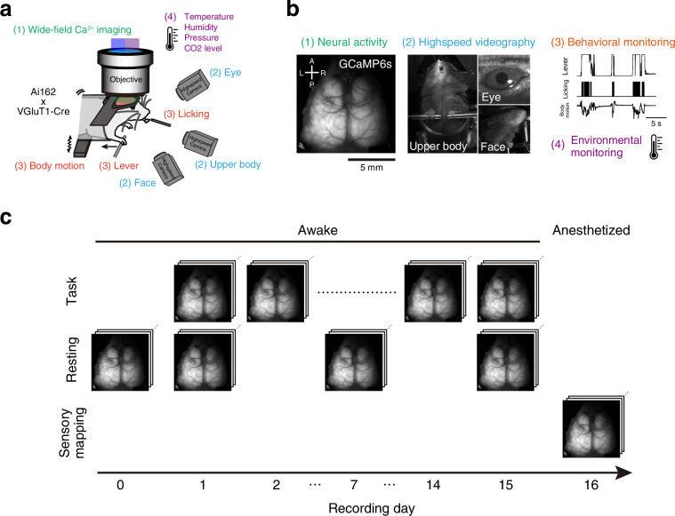

# Multimodal dataset linking wide-field calcium imaging to behavior changes in operant lever-pull task in mice

- **タイトル和訳**: マウスのオペラント・レバー引き課題における広視野カルシウムイメージングと行動変化を結びつけたマルチモーダルデータセット
- **著者**: Masashi Kondo, Keisuke Sehara, Rie Harukuni, Ryo Aoki, Shoya Sugimoto, Yasuhiro R. Tanaka, Masanori Matsuzaki, Ken Nakae
- **誌名**: Scientific Data, Volume 12, Article 1264 (2025)
- **DOI**: [10.1038/s41597-025-05482-y](https://doi.org/10.1038/s41597-025-05482-y)
- **リンク**: [Nature](https://www.nature.com/articles/s41597-025-05482-y) / [PMC](https://pmc.ncbi.nlm.nih.gov/articles/PMC12307678/) / [bioRxiv preprint](https://www.biorxiv.org/content/10.1101/2025.02.03.631599)
- **原本**: 全文PDF・Supplementary Information（DOCX）を [reference/sources/](sources/) に保存している。
  - [kondo2025_braidynbc_dataset_fulltext.pdf](sources/kondo2025_braidynbc_dataset_fulltext.pdf)
  - [kondo2025_braidynbc_dataset_supplement.docx](sources/kondo2025_braidynbc_dataset_supplement.docx)（Table S1: 使用ソフトウェア一覧、Figure S1–S4のキャプション）

## Figure 1

*出典: Kondo et al. (2025) Scientific Data, [10.1038/s41597-025-05482-y](https://doi.org/10.1038/s41597-025-05482-y)（個人の研究メモ用途での引用）*

## 要旨（原文PDFに基づく）

- **問題提起**
  - 運動学習に伴う神経メカニズム、セッション内の急速な学習効果、長期的な行動適応、神経回路ダイナミクスを調べるには、単一モダリティではなく、神経活動・身体運動・環境パラメータを同時かつ長期的に記録したデータセットが必要。
  - 既存研究の多くは記録期間が短い、あるいはモダリティが限定的という制約があった。
- **タスク**
  - 頭部固定したマウスがレバーを引いて水報酬を得るオペラント課題。
    - 音キュー提示後、要求される最小引き時間（`T_pull`）以上レバーを引き続けると成功し水報酬が出る。
  - `T_pull` は成功率に応じて動的に増加（初期1ms→80%成功率ごとに+50ms、最大400ms）。
    - セッションを追うごとに課題が難化する設計。
- **データセット構成**
  - マウス25匹を対象に記録（詳細は下記「データセットの構成」節）。
    - プレトレーニング後の2週間・15セッションの課題訓練（`task-day1`〜`task-day15`）。
    - resting-state記録（day 0, 1, 7/8, 15）とsensory-mapping記録（day 16）。
  - 記録モダリティ:
    - 広視野1光子カルシウムイメージングによる大脳皮質全体の神経活動。
    - DeepLabCutによる身体・顔・眼球運動の姿勢推定。
    - レバー位置・報酬・環境センサ等。
  - NWB (Neurodata Without Borders) 形式に整形し、FAIR原則に準拠。DANDI ArchiveとGINで公開。
- **検証結果（Technical Validation）**
  - 応答率は訓練セッション1の中央値約0.55からセッション15で約0.85に上昇。
  - 個体は要求引き時間への到達パターンで2クラスタに分かれる。
  - resting-state中も自発的なレバー引きが見られる。
  - MesoNetベースの皮質領域レジストレーションとDeepLabCutキーポイント推定は、いずれも手動アノテーション・独立計測との比較で妥当性が確認されている。
    - レバー先端位置の推定精度: 相関係数0.98±0.02。

## データセットの構成（Methods / Data Records より）

### 動物・課題スケジュール

- マウス25匹（オス11・メス14、実験終了時17–31週齢）。VGluT1-Cre × Ai162 の交配で興奮性ニューロンに GCaMP6s を発現する系統。
- 全体のスケジュールは約1か月。プレトレーニング3–8日 → 課題訓練セッション×15日（週末等で2–3日の休止を挟む）という流れ。
- **recording day** の定義（本論文の日番号は、本リポジトリの `task-dayN` と対応関係にあるが、範囲がより広い）:
  - **day 0**: プレトレーニング最終日に実施する resting-state 記録（課題前のベースライン）
  - **day 1–15**: 課題訓練セッション（1日1回、30分/回）。本リポジトリの `task-day1`〜`task-day15` に相当。
  - **day 1, 7 (or 8), 15**: 課題訓練後に resting-state 記録も実施（10分/回）。1匹のみ day 7 ではなく day 8 に実施。
  - **day 16**: 全15セッション終了後1–6日以内に実施する sensory-mapping セッション（麻酔下、15分）。8匹は2回実施。
- つまり **resting-state 記録は1匹あたり4セッション（day 0, 1, 7or8, 15）**、**sensory-mapping は1匹あたり1〜2セッション**（Table 1）。
- 375セッション中364セッションでデータ収集に成功（回収率97%、残り11セッションはimaging不良）。25匹中16匹は全15セッションを完全収録。
### 記録系（Behavioral apparatus）

- レバー: 基準位置から4mmまで可動、1mm以上の変位が「pull」。引き開始に0.04Nの力が必要。位置はロータリーエンコーダで記録。
- 音キュー: 10kHz純音、70dB SPL、200ms。キュー提示後1秒以内に規定時間（T_pull、初期1ms→80%成功率ごとに+50ms、最大400ms）以上レバーを引き続けると成功、水報酬4μL。
- 環境センサ（気温・湿度・気圧・CO2）を20Hzで、それ以外のアナログ入力・TTLパルスは5kHzでLabview経由でDAQ収録。
- 高速カメラ3台（上半身・顔右側・右眼、各100Hz、Basler acA1440-220um）。
### イメージング

- 広視野1光子カルシウムイメージング（THT mesoscope）。588×588px、60Hzで405nm/470nm交互励起 → 実効30Hz。288×288pxにダウンサンプリング後、NoRMCorreでモーション補正。
- Allen CCF（Common Coordinate Framework）にMesoNetベースの頭蓋ランドマーク推定でレジストレーションし、半球あたり22 ROIに区分。
- ヘモダイナミクス補正: 470nm信号（ΔF_B/F_B）を405nm信号（ΔF_V/F_V、GCaMPの等吸収点付近）で線形回帰し、残差を補正済みカルシウム信号として提供。
### DeepLabCutによる姿勢推定

- 上半身5点・顔14点・眼4点（瞳孔中心のみ楕円フィッティングで算出、DLC直接推定ではない）のキーポイントを、DeepLabCut 2.3.10で抽出。
- 動画のフレームレート（100Hz）→ 5kHz DAQへアップサンプル → 30Hz（imaging frame rate）へダウンサンプル。
### NWBファイルのデータ構造（Table 4）

各セッションはNWBファイル1つ・TIFFファイル2つ・MP4ファイル3つで構成される。NWBファイル内の主なチャンネル（Raw / Down-sampled(DS) の有無、単位、型）:

| チャンネル名 | Raw | DS | 単位 | 型 | 説明 |
| :--- | :--: | :--: | :--- | :--- | :--- |
| `tone` | ○ | ○ | V | Digital (TTL) | 音キュー（10kHz純音）のON |
| `lever` | ○ | ○ | mm | Analog | 基準位置からのレバー距離 |
| `reward` | ○ | ○ | V | Digital (TTL) | 報酬供給パルス |
| `lick` | ○ | ○ | V | Digital (TTL) | リックスプートとの接触検知 |
| `lick_rate` | — | ○ | Hz | Analog | 指数核を畳み込んだリック率 |
| `motion` | ○ | ○ | a.u. | Analog | ロードセルによる体動 |
| `pull_duration` | ○ | — | ms | Integer | その時点で要求される最小引き時間（`T_pull`） |
| `state_lever` | ○ | ○ | NA | Boolean | レバーが引かれた状態かどうか |
| `state_task` | ○ | ○ | NA | Integer | 課題フェーズ: 待機(0) / キュー提示(1) / 報酬(2) |
| `air_pressure` / `CO2_level` / `humidity` / `room_temp` | ○ | ○ | hPa / ppm / % / °C | Analog | 環境センサ |
| `LED_B` / `LED_V` | ○ | — | V | Digital (TTL) | 470nm/405nm励起LEDのON |
| `img_acquisition` | ○ | — | V | Digital (CMOS) | イメージングフレーム取得パルス |
| `video_trig` | ○ | — | V | Digital (TTL) | ビデオフレーム取得トリガ |

処理済みデータは `analysis` / `processing` 以下に格納され、`processing/behavior/data_interfaces` にDLCキーポイント（`eye_video_keypoints` / `face_video_keypoints` / `body_video_keypoints`）と `eye_position` / `pupil_tracking`、`downsampled/data_interfaces/trials` に上記センサ値がイメージングフレームと同期した試行情報として格納される。

上記は論文本文（Table 4）記載の設計仕様。実ファイル（GIN由来の1件）を開いて計測したグループ別サイズ内訳・実サンプル数・DLCノード名の実測結果は [docs/data.md](../docs/data.md) の「NWBファイルの内部構造とサイズ内訳（実測）」を参照。

論文本文には `trials_L1L2.csv` のような独立CSVファイルの記載はなく、試行情報はNWB内の `downsampled/data_interfaces/trials` に格納される設計になっている。ローカルで使っている `trials_L1L2.csv` はハッカソンで作成した抽出物で、音なし条件も含むすべてのレバー引き試行についてレバー引き時間を計算している（詳細は [docs/data.md](../docs/data.md)）。
### データ公開先（Data Records セクション）

論文本文で明記されている正式な公開先は次の2つ:

- **DANDI Archive**: https://dandiarchive.org/dandiset/001425/ （DOI: 10.48324/dandi.001425/0.250705.0947）。Raw imagingを含む完全版。
- **GIN**: https://gin.g-node.org/BraiDyn-BC/Kondo2025_CuedLeverPullNWB （DOI: 10.12751/g-node.zbh16l）。**「軽量であることを意図しており、NWBファイルにRaw imagingデータのエントリを含まない」と論文中に明記**されている。
- Google Colab用のPythonチュートリアル一覧: https://drive.google.com/drive/folders/1QciTJd3tXkEGhz6782czB2dEO3fafm8M
- 解析パイプラインのソースコード（MITライセンス）: https://github.com/BraiDyn-BC/bdbc-data-pipeline

プラットフォームごとの比較（AWS S3を含む）は [docs/data.md](../docs/data.md) の「正式な公開先」表を参照。
### 主要な検証結果（Technical Validation）

- 応答率は訓練セッション1の中央値約0.55から、セッション15で約0.85に上昇。成功率は全体として横ばい。
- `T_pull_final`（セッション終了時点の要求引き時間）の推移で階層クラスタリングすると、動物は早期に高い`T_pull_final`へ到達し維持するクラスタA（n=7）と、後期まで到達しないが最終的に類似の成功率へ至るクラスタB（n=18）に分かれる。
- resting-state中もレバーを自発的に引く行動が見られ、課題セッションの方が引き頻度は高い傾向（動物ごとの変化パターンは多様）。
- MesoNetベースのAllen CCFレジストレーションは、手動アノテーションとの比較および感覚刺激マッピング（視覚→対側後頭皮質、聴覚→頭頂皮質、触覚→対側SSp-bfd）で妥当性を確認。
- DeepLabCutのキーポイント推定は手動アノテーションと比較して誤差小。レバー先端の推定位置とロータリーエンコーダの実測値の相関係数は0.98±0.02（356セッション、25匹）。