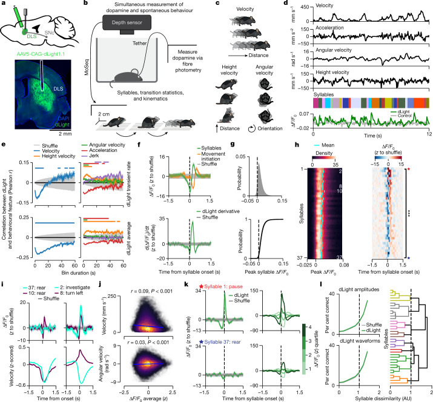

# Spontaneous behaviour is structured by reinforcement without explicit reward

- **著者**: Jeffrey E. Markowitz, Winthrop F. Gillis, Maya Jay, Jeffrey Wood, Ryley W. Harris, Robert Cieszkowski, Rebecca Scott, David Brann, Dorothy Koveal, Tomasz Kula, Caleb Weinreb, Mohammed Abdal Monium Osman, Sandra Romero Pinto, Naoshige Uchida, Scott W. Linderman, Bernardo L. Sabatini, Sandeep Robert Datta
- **誌名**: Nature, 614(7946), 108–117 (2023年1月18日)
- **DOI**: [10.1038/s41586-022-05611-2](https://doi.org/10.1038/s41586-022-05611-2)
- **リンク**: [Nature](https://www.nature.com/articles/s41586-022-05611-2) / [PMC](https://pmc.ncbi.nlm.nih.gov/articles/PMC9892006/)

## Figure 1

*出典: Markowitz et al. (2023) Nature, [10.1038/s41586-022-05611-2](https://doi.org/10.1038/s41586-022-05611-2)（個人の研究メモ用途での引用）*

## 要旨（要約）

課題構造・感覚手がかり・外因性報酬が一切ない自由行動下でも、マウスの自発的な行動（モーションモジュール列）はドパミン変動によって体系的に構造化されることを示した研究。背側線条体（DLS）のドパミン変動は行動モジュールの使用頻度・出現順序を変化させ、後続の行動選択を予測できた。光遺伝学的操作により、ドパミンが特定の行動モジュールを強化し、行動配列の多様性を増加させることを確認。強化学習モデルによる解析から、ドパミン変動が報酬信号の代替として機能し、線条体が行動モジュールを動的に組み立てていることが示唆された。著者らのモデル化基盤には HMM 系列モデルを用いる `keypoint-moseq`（Linderman lab）系の手法が含まれる。

## この研究との関連

- 本研究の RQ2（H2: 脳-身体カップリングの強化）で扱う「中枢（皮質）から末梢（表情・行動）への情報伝達」の背後にある神経修飾物質（ドパミン）の役割を考える際の参照点になる。報酬なしでも自発的な行動構造化が起こるという知見は、本研究の Reward History 入力（[docs/requirements_ver4.md](../docs/requirements_ver4.md) 4.2節）だけでは捉えきれない内発的な行動組織化の可能性を示唆する。
- 著者に本リポジトリが使う `ssm` ライブラリの開発者である Scott W. Linderman が含まれており、GLM-HMM 系の手法（[ashwood2022_discrete_strategies.md](ashwood2022_discrete_strategies.md)）と同じ研究系譜に位置する。
