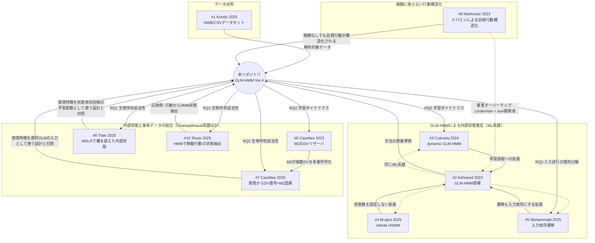

# 先行文献の関連マップ

10本の先行文献（[all_references.md](all_references.md)）どうしの関係、および本リポジトリの研究計画（[docs/RQ.md](../docs/RQ.md)）との対応を1か所にまとめたもの。各論文の書誌情報・要旨は [all_references.md](all_references.md)、PDFが手元にある6本（#1, #2, #3, #4, #7, #8）の詳細なモデル定義・メソッドは個別ファイルを参照。

## 全体マップ

凡例: 実線矢印は「手法・知見が本リポジトリへ流れ込む向き」、破線は「同一系譜・著者オーバーラップ」、Repoから外向きの矢印は「本リポジトリのRQが参照する先行知見」を表す。

## クラスタ別の解説と本リポジトリとの技術的対応

### データ出所

**#1 Kondo et al. 2025** — 本リポジトリが解析対象とする NWB / CSV データそのものの記述論文。セッション構成（2週間・15セッション）は本リポジトリの `Day 1–15` という課題日レンジと一致する（論文の正式なセッション体系にはこれ以外に `day 0`・`day 16` も含む）。データの取得元・前処理仕様（`merge_asof` でのCSV/NWB統合など、[docs/requirements_glmhmm.md](../docs/requirements_glmhmm.md) 3.2節）を理解する上で、この論文のMethodsを一次情報として参照する価値が高い。
### GLM-HMMによる内部状態推定（IBL系譜）

**#2 Ashwood et al. 2022** — 本リポジトリの GLM-HMM 実装（Ver.3 / Ver.4）が直接準拠する原著論文。

- [docs/requirements_glmhmm.md](../docs/requirements_glmhmm.md) 冒頭に「採用モデル: Bernoulli GLM-HMM (Ashwood et al., 2022 準拠)」と明記。README.md の「ライセンス・出典」節も同様。
- 本研究の RQ1「内部状態（Engaged vs Random）の生物学的妥当性」は、この論文が定義した Engaged/Biased 状態の枠組みをそのまま踏襲している。
- ssm ライブラリ（`lindermanlab/ssm`）の Input Driven Observations 実装は、この論文の著者グループ（Pillow Lab / Linderman Lab）が公開したもの。
- **デザイン行列の対応**: `src/glmhmm_ver4.py` の `BEHAVIOR_COLS`（`x_bias` / `x_stim` / `x_hist` / `x_rew` の4列）は、Ashwood et al. のデザイン行列4列（Bias / Stimulus / 前試行の選択 / win-stay-lose-switch）と同じ4カテゴリ（bias・刺激・行動履歴・報酬履歴）に対応する。ただし `x_hist` / `x_rew` は1試行ラグの離散変数ではなく指数減衰する履歴変数（[docs/requirements_glmhmm.md](../docs/requirements_glmhmm.md) 4.2節）である点がAshwood et al. の1ラグ共変量と異なる。
- **状態数 $K$ の対応**: `src/glmhmm_ver4.py` の既定値 `NUM_STATES = 3` は、Ashwood et al. がIBLマウス37匹のcross-validationで選んだ $K=3$ と同じ値。本リポジトリはこの既定値を踏襲し、13次元入力モデル（表情特徴込み）ではK=2とK=3を比較しているが、動物ごとの系統的なcross-validationによる$K$選択は行っていない。

**#3 Cuturela et al. 2024** — Ashwood et al. のGLM-HMM枠組みを学習過程（微分的なセッション進行）へ拡張した続報。

- 本研究の RQ2「学習による表現と結合の変容」で扱う "学習初期 vs 学習後期" の内部状態比較に、直接の先行知見を与える。「内部状態は学習初期から既に存在する」という結果は、H3（ミス試行の二重機序モデル）の「学習初期 (Mismatch): 脳は従事しているが身体が追いつかない」という仮説の前提（＝学習初期でも Engaged 状態自体は既にある）を支持する。
- 本リポジトリの Ver.4 実装（`notebooks/14_glmhmm_ver4_trials.ipynb`）は各 `task-dayN` を独立に学習する設計（README.md「解析パイプライン」表に「日ごとに独立学習」と明記）であり、セッション間でパラメータを共有・平滑化する dynamic GLM-HMM のアプローチは採用していない。日をまたいだ状態遷移や学習曲線を扱う拡張を検討する際の参考手法になる。

**#4 Bruijns et al. 2025** — 状態数を固定しないIBL系譜の最新拡張。

- 本リポジトリの GLM-HMM は状態数 K を固定（Ver.4 では K=3）して学習するが、この論文は無限HMMアプローチを取る。状態数の妥当性を検討する際の比較対象・拡張案として参考になる。
- 「新しい行動はセッション開始時に生じやすい」という知見は、Ver.4で用いる Action History / Reward History のようなセッション内の履歴依存変数の設計に示唆を与える。

**#5 Mohammadi et al. 2025** — Ashwood et al. を「状態遷移も入力依存にする」方向へ拡張した直接の後継研究。

- 本リポジトリの Ver.3/Ver.4 入力変数のうち、Reward History が従事度（Engaged/Random）の切り替えを駆動するという知見は、この論文の「過去の報酬が Engagement の切り替えを駆動する」という結果と整合的。
- 本研究の RQ3「ミス試行の質的分解」において、状態遷移の駆動要因（刺激 vs 報酬）を切り分ける視点は、この論文の分析枠組みと同型。
### 内部状態と身体データの結合

**#6 Cazettes et al. 2023** — 皮質側（特に運動野）が内部状態・意思決定変数をどう表現するかの神経基盤を示す先行研究。

- 本研究の Main RQ「皮質活動（中枢）と表情（末梢）の動的な結合」における神経基盤の先行研究。RQ2 の仮説 H1「学習初期の皮質活動は運動に強く相関するが、学習後期には内部状態との相関が支配的になる」という状態表現のシフトを考える際、「M2が複数の意思決定変数を同時多重化する」という知見は、皮質活動から内部状態をデコードする解析（Phase 2: Multimodal Decoding）の理論的背景となる。

**#7 Cazettes et al. 2025** — 本研究の Main RQ「皮質活動（中枢）と表情（末梢）の結合」を直接支持する、最も重要な先行研究の一つ。

- 「表情が内部状態の実体を伴う現象であるか」という RQ1（生物学的妥当性）に対し、この論文はまさに「表情が潜在的な認知変数を反映する」ことを実証しており、本研究の前提そのものを補強する。
- 表情特徴の一部が M2（運動野）由来であるという知見は、H2「脳（中枢）から表情（末梢）への情報伝達」という結合の方向性の仮説と整合する。
- LM-HMMは「連続失敗数」という行動指標を状態依存の線形回帰で予測するモデルであり、本リポジトリのGLM-HMM（行動選択そのものをBernoulli GLMで予測）と観測変数の型（Gaussian vs Bernoulli）が異なる。DVを表情から復号する際のGLM設計（elastic net正則化・nested CV・直交化による「unique」成分の抽出・恣意信号によるネガティブコントロール）は、顔特徴量から内部状態を予測する解析を組む際の方法論的テンプレートとして直接参照できる。

**#8 Tlaie et al. 2025** — 本研究の Main RQ「HMM/状態空間モデルと身体データ（表情）の統合方法」に対する、直接的な方法論的参考文献。

- 本リポジトリの GLM-HMM（#2 Ashwood et al. 準拠）は、表情特徴を**選択GLMの入力共変量**として使う設計（`notebooks/14_glmhmm_ver4_trials.ipynb` の13次元入力＝4次元行動変数＋9次元顔特徴）。一方MSLRは、表情特徴を**予測変数（predictor）**、行動指標（RT）を**出力（emission）**とし、状態ごとに両者を結ぶ回帰係数を切り替える。同じ「HMM×身体データ」でも、身体データを (a) 状態を決めるGLMの入力にするか、(b) 状態依存の回帰で行動を予測する側の入力にするか、という2つの統合方向がある点に注意。本リポジトリのVer.4拡張を設計・解釈する際は、どちらの統合方向を取っているかを明示すると良い。
- マウスで用いる顔特徴数（9）が本リポジトリの顔特徴次元と一致する点は、特徴選定の参考になる可能性がある。
- 「注意／衝動的／不注意」という3状態の解釈は、本研究のミス試行分解（RQ3, H3: Mismatch vs Joint Disengagement）における状態のラベリングと比較可能な参照枠を与える。
- ARHMM対照実験の設計（身体データなしのRT自己回帰HMMと比較する）は、本リポジトリで「表情特徴を加えることの寄与」を検証する際の対照群の組み方として直接転用できる。
- 実装ライブラリはssmではなくDynamax（JAX）である点に注意。本リポジトリはssm（`docs/`・`src/glmhmm_ver4.py` 参照）を使用しており、直接のコード流用はできない。

**#10 Shuto et al. 2025** — GLM-HMMとは異なる文脈（自由行動下のロコモーション）でHMMを用いて離散的な行動状態を抽出する応用例。

- 状態数を少数（3状態）に絞って解釈可能性を重視する設計は、本リポジトリのVer.4（K=3）の状態数選択と方向性が近い。
- 「行動状態がタスク要求（視覚刺激）に応じて遷移する」という枠組みは、本研究のRQ1（内部状態の生物学的妥当性）における「HMMで定義された状態が、行動レベルでも一貫したパターンとして観測されるか」という検証の一般的な方法論の参考になる。
### 報酬に依らない行動構造化

**#9 Markowitz et al. 2023** — 中枢から末梢への情報伝達を駆動する神経修飾物質（ドパミン）の役割を考える際の参照点。

- 本研究のRQ2（H2: 脳-身体カップリングの強化）で扱う「中枢（皮質）から末梢（表情・行動）への情報伝達」の背後にあるドパミンの役割を考える際の参照点になる。報酬なしでも自発的な行動構造化が起こるという知見は、本研究のReward History入力（[docs/requirements_glmhmm.md](../docs/requirements_glmhmm.md) 4.2節）だけでは捉えきれない内発的な行動組織化の可能性を示唆する。
- 著者に本リポジトリが使う `ssm` ライブラリの開発者である Scott W. Linderman が含まれており、GLM-HMM系の手法（#2 Ashwood et al.）と同じ研究系譜に位置する。
