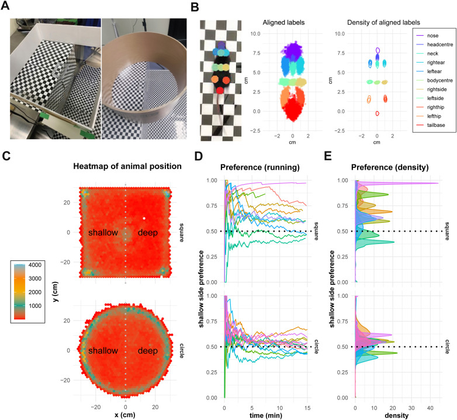

# Hidden Markov models reveal behavioral state dynamics in depth-related locomotion in mice

- **著者**: Hironobu Shuto, Toshiki Maeda, Chieko Koike, Masayo Takahashi, Michiko Mandai, Take Matsuyama
- **誌名**: PLOS ONE, 20(8), e0329367 (2025)
- **DOI**: [10.1371/journal.pone.0329367](https://doi.org/10.1371/journal.pone.0329367)
- **リンク**: [PLOS ONE](https://journals.plos.org/plosone/article?id=10.1371/journal.pone.0329367) / [PMC](https://www.ncbi.nlm.nih.gov/pmc/articles/PMC12380309/) / [bioRxiv preprint](https://www.biorxiv.org/content/10.1101/2025.07.09.663818)

## Figure 1

*出典: Shuto et al. (2025) PLOS ONE, [10.1371/journal.pone.0329367](https://doi.org/10.1371/journal.pone.0329367)。CC BY 4.0。*

## 要旨（要約）

視覚的な奥行き手がかりに対するマウスの応答を調べるため、円形装置と隠れマルコフモデル（HMM）解析を組み合わせた研究。マウスは奥行き手がかりに応じて「静止（resting）」「探索（exploring）」「移動（navigating）」の3つの行動状態間を遷移することが示された。奥行き知覚には最適な空間周波数帯（6〜8 cm相当）があり、単純な回避行動ではなく複数の空間手がかりを統合した処理が行われていること、初期の強い崖回避反応が時間とともにより繊細な行動適応へ変化することが明らかになった。野生型マウスと網膜変性モデル（rd1-2J）の比較により、これらの行動パターンが視覚処理を特異的に反映することが確認された。

## この研究との関連

- GLM-HMM とは異なる文脈（自由行動下のロコモーション）で HMM を用いて離散的な行動状態を抽出する応用例。状態数を少数（3状態）に絞って解釈可能性を重視する設計は、本リポジトリの Ver.4（K=3、`notebooks/14_glmhmm_ver4_trials.ipynb`）の状態数選択と方向性が近い。
- 「行動状態がタスク要求（視覚刺激）に応じて遷移する」という枠組みは、本研究の RQ1（内部状態の生物学的妥当性）における「HMMで定義された状態が、行動レベルでも一貫したパターンとして観測されるか」という検証の一般的な方法論の参考になる。
