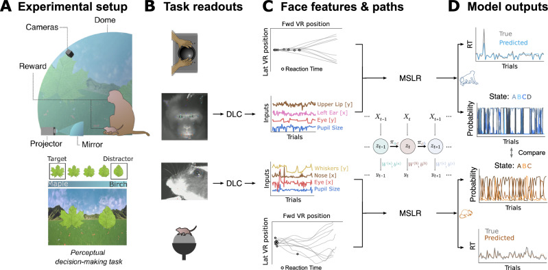

# Inferring internal states across mice and monkeys using facial features

- **タイトル和訳**: 顔特徴を用いたマウスとサルにまたがる内部状態の推定
- **著者**: Alejandro Tlaie, Muad Y. Abd El Hay, Berkutay Mert, Robert Taylor, Pierre-Antoine Ferracci, Katharine Shapcott, Mina Glukhova, Jonathan W. Pillow, Martha N. Havenith, Marieke L. Schölvinck
- **誌名**: Nature Communications, 16, Article 5168 (2025)
- **DOI**: [10.1038/s41467-025-60296-1](https://doi.org/10.1038/s41467-025-60296-1)
- **リンク**: [Nature](https://www.nature.com/articles/s41467-025-60296-1) / [PMC](https://pmc.ncbi.nlm.nih.gov/articles/PMC12137566/) / [PubMed](https://pubmed.ncbi.nlm.nih.gov/40467558/)
- **原本**: 出版版の全文・Supplementary Informationを [reference/sources/](sources/) に保存している。
  - [tlaie2025_facial_features_mice_monkeys_fulltext.pdf](sources/tlaie2025_facial_features_mice_monkeys_fulltext.pdf)（下記「モデルの定義」節はこのPDFのMethods "Markov-switching linear regression" / "Model tuning" / "ARHMM" 節に基づく）
  - [tlaie2025_facial_features_mice_monkeys_supplement.pdf](sources/tlaie2025_facial_features_mice_monkeys_supplement.pdf)（Supplementary Figures）

## Figure 1

*出典: Tlaie et al. (2025) Nature Communications, [10.1038/s41467-025-60296-1](https://doi.org/10.1038/s41467-025-60296-1)。CC BY 4.0。*

## 要旨（原文PDFに基づく）

- **問題提起**
  - 内部認知状態（注意・衝動性など）は動物の行動を大きく左右するが、種を超えて共通の実体を持つかは不明。
  - マウスとサルという2種に同一の自然主義的タスクを課し、共通のパイプラインで内部状態を推定・比較できれば、種横断的な内部状態の存在を検証できる。
- **タスク**
  - バーチャルリアリティ（VR）ドーム内で、マウス（7匹・29セッション・12,714試行）とマカクザル（2頭・18セッション・20,459試行）が同一の視覚採食課題を行う。
    - ターゲット刺激（葉の形）に近づき、ディストラクタ刺激を避けるように移動。
    - 走行軌跡の転換点から反応時間（RT）を定義する。
  - 刺激提示前の顔動画（マウス側面1台、サル正面1台＋アイトラッキング）からDeepLabCutでキーポイントを抽出し、顔特徴（マウス9次元・サル18次元、各キーポイントの垂直・水平位置中央値＋速度）を求める。
- **数理モデル**
  - 刺激提示前の顔特徴を入力、同じ試行のRTを出力とする Markov-Switching Linear Regression（MSLR）を種ごとに学習（定式化は下記「モデルの定義」節）。
    - 試行単位で内部状態の確率とRT予測値を得る。
  - 状態数はcross-validationで選択し、マウス3状態・サル4状態が最適だった。
- **結果（内部状態と成績の対応）**
  - RTのみで学習したにもかかわらず、モデルは課題成績（hit/wrong/miss）も予測できた。
  - マウス・サル共通の3プロファイル:
    - **注意（attentive）**: 速い反応・高成績。
    - **衝動的（impulsive）**: 速いが不正解が多い。
    - **不注意（inattentive）**: 遅く成績も悪い。
  - 対応する顔特徴パターンにも部分的な重なりが見られた。
- **状態遷移の種差**
  - マカクザルは状態が安定して持続する（遷移行列の対角成分が高い）。
  - マウスは状態間をより頻繁に遷移した。
    - この差はサンプル数・特徴数を種間でマッチさせた対照解析でも再現され、単純なデータ構造の違いに起因するものではなかった。
- **対照実験（ARHMM）**
  - 表情の代わりに前試行のRTのみを入力とするAuto-Regressive HMMと比較。
  - facial-features版のMSLRが両種・全状態でARHMMを上回ることを確認。
    - 表情が単なる試行履歴の代理変数ではないことの根拠。
- **GLM-HMMとの相互検証**
  - 同じデータに個体・セッション単位でGLM-HMM（行動選択ベース、Ashwood et al. 2022と同じ枠組み）を適用しても類似の結果が得られたと報告している。

## モデルの定義（Methods "Markov-switching linear regression" / "Model tuning" / "ARHMM" より）

**MSLR（Markov-Switching Linear Regression）** は、離散マルコフ連鎖の状態ごとに異なる線形回帰を対応させる状態空間モデル。実装には `ssm` ではなく [Dynamax](https://github.com/probml/dynamax)（JAX製の状態空間モデルライブラリ）を用いている。

- 離散潜在状態 $z_t \in \{0, \dots, S-1\}$ がマルコフ連鎖として遷移する（遷移行列はDirichlet事前分布）。
- 入力（predictor） $x_t \in \mathbb{R}^M$: 試行 $t$ の**刺激提示前**の表情特徴（マウス9次元・サル18次元。各顔キーポイントの垂直・水平位置の中央値と速度）。
- 出力（emission） $y_t \in \mathbb{R}^N$: 同じ試行の反応時間（RT、 $N=1$）。
- 状態 $z_t=s$ が与えられたときの emission 分布: $y_t \mid z_t=s, x_t \sim \mathcal{N}(W_s x_t + b_s,\ \Sigma_s)$、 $W_s \in \mathbb{R}^{N \times M}$（状態ごとの回帰重み）、 $b_s \in \mathbb{R}^N$（バイアス）、 $\Sigma_s \in \mathbb{R}^{N \times N}$（emission共分散）。
- つまり **「どの表情特徴がRTを予測するか」という回帰係数そのものが、隠れ状態によって切り替わる**モデル。ある状態では眉の動きがRTを予測し、別の状態では鼻のsniffingが予測する、といった対応を想定している。

**学習**: EMアルゴリズムを50反復、パラメータ初期値を変えて10回リピートし最良解を採用。訓練:テスト = 80:20。セッションをまたぐ結合時は50試行分の予測変数・出力を0にする強制遷移を挟み、状態確率をリセットする。

**ハイパーパラメータ探索（Model tuning）**: Dirichlet事前分布の濃度パラメータ $\alpha$（遷移行列の疎さ）と、stickiness パラメータ $\kappa$（対角成分への自己バイアス項、状態が長く持続しやすくする）をグリッドサーチし、cross-validated $R^2$ で選択。

**状態数 $S$ の決定**: cross-validated $R^2$ が頭打ちになる点を、CV性能曲線の有限差分（finite difference）で検出して選択（Ashwood et al. 2022 のプラトー検出と同じ発想）。サルは $S=4$、マウスは $S=3$ が最適だった。

**対照実験（ARHMM）**: 表情特徴の代わりに前試行のRT（ $t-1$）のみを入力としたAuto-Regressive HMMを比較対象として学習し、facial-features版のMSLRが全状態でARHMMを上回ることを確認（表情が単なる試行履歴の代理変数ではないことの根拠）。

**GLM-HMMとの相互検証**: Discussionで、同じデータに対して個体・セッションごとにGLM-HMM（行動選択ベース、Ashwood et al. 2022と同じ枠組み）を学習しても類似した結果が得られたと報告している（本文参照文献73）。
