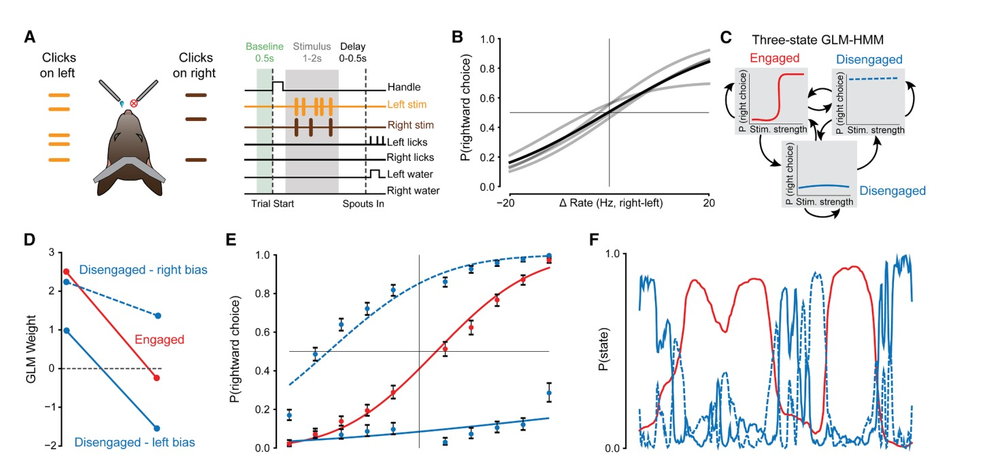

# Spontaneous movements and their relationship to neural activity fluctuate with latent engagement states

- **タイトル和訳**: 自発運動と神経活動の関係は潜在的な従事状態によって変動する
- **著者**: Chaoqun Yin (尹超群), Maxwell D. Melin, Gabriel Rojas-Bowe, Xiaonan Richard Sun, João Couto, Steven Gluf, Alex Kostiuk, Simon Musall, Anne K. Churchland
- **誌名**: Neuron 113, 3048–3063 (2025-09-17発行、オープンアクセス・CC BY-NC-ND 4.0)
- **DOI**: [10.1016/j.neuron.2025.06.001](https://doi.org/10.1016/j.neuron.2025.06.001)
- **リンク**: [Neuron (cell.com)](https://www.cell.com/neuron/fulltext/S0896-6273(25)00432-5)
- **原本**: 出版版の全文（cell.com版、22ページ）とSupplemental Information（18ページ）を [reference/sources/](sources/) に保存している。
  - [yin2025_engagement_states_fulltext.pdf](sources/yin2025_engagement_states_fulltext.pdf)（下記「要旨」「モデルの定義とメソッド」は全文このPDFに基づく）
  - [yin2025_engagement_states_supplement.pdf](sources/yin2025_engagement_states_supplement.pdf)

## Figure 1

*出典: Yin et al. (2025) Neuron, [10.1016/j.neuron.2025.06.001](https://doi.org/10.1016/j.neuron.2025.06.001)（個人の研究メモ用途での引用）*

## 要旨（原文PDFに基づく）

- **問題提起**
  - 皮質ニューロンの活動は試行間変動が大きく、単一試行の応答解釈を難しくしてきた。この変動性への対処として、(1) 動物の運動を制限して記録する方法と (2) 同一条件の多数試行を平均する方法が用いられてきたが、前者は自発運動が頻繁な自然な意思決定から乖離し、後者は神経活動と行動の関係が実は非定常（状態依存）でありうることを見落とす。
  - 行動モデリングにより、動物が1セッション内で従事（engaged）・非従事（disengaged）状態を行き来することは知られていたが、こうした状態の変動が皮質全体の神経活動にどう影響するか、また自発運動が意思決定の成否とどう関わるかは未解明だった。
- **タスク**
  - Task 1（主データセット・広視野イメージング対象）: 頭部固定マウス4匹に、左右のスピーカーから提示されるPoisson分布のクリック音列（1〜2秒）の頻度差を弁別させる遅延つき空間聴覚弁別課題。ハンドル接触（0.25〜0.75秒）で試行開始、0.5秒のbaseline、クリック提示（stimulus）、0〜0.5秒のdelay、その後2本の給水スパウトが接近し、頻度の高い側を2回舐めると報酬。EMX-Cre-GCaMP6sで全錐体細胞にGCaMP6sを発現させ、同時に広視野カルシウムイメージング（大脳皮質背側全体）を実施。別途Fezf2-CreERで錐体路（PT）ニューロンを標識したマウス5匹でも同じ課題を実施し結果を追試。
  - Task 2（瞳孔径-従事度解析用の別データセット）: 視覚版の時空間弁別課題を行う頭部固定マウス6匹から、瞳孔径とDeepLabCutによる30部位の体動追跡データを取得。
  - Task 3（種を超えた汎化検証）: 自由行動下のラットに聴覚・視覚・両感覚を組み合わせた1.0秒の刺激系列の個数（7〜17）を弁別させる2択課題（決定境界12）。DeepLabCutで19部位を追跡。
  - 9匹の追加マウス（光遺伝学的抑制実験由来、またはEMX以外の細胞標識）でもTIM-成績相関を確認しているが、これらはGLM-HMMには含まれない。
- **数理モデル**
  - Ashwood et al. (2022) 準拠の3状態Bernoulli GLM-HMM（`ssm`パッケージ、MAP+EM）で、各試行を従事状態1つと非従事（左右バイアス）状態2つに分類する（定式化は下記「モデルの定義とメソッド」節）。
  - 線形符号化モデル（Musall et al. 2019に準拠、リッジ回帰）で、タスク変数・指示運動・無指示運動を回帰子として神経活動（ΔF/F）を再構成し、従事/非従事状態ごとに別々に学習することで状態依存の説明分散を比較。
  - 新規指標TIM（Task-Independent Movement）: 7つのタスク変数（今試行の刺激強度・選択・報酬・選択×報酬の交互作用、前試行の選択・報酬・交互作用）から予測される体部位軌跡と、実際の軌跡とのユークリッド距離として定義（下記参照）。
- **論文固有の要素**
  - 「エンコードモデルにおける説明分散の変化」を、タスク整合（task-aligned）運動由来の分散とタスク非依存（task-independent）運動由来の分散に分解する解析手法（Musall et al. 2019の手法を踏襲）。タスク変数のみのモデルと運動込みモデルの差分でtask-independent分散を求め、運動のみモデルの全分散からそれを引いてtask-aligned分散を求める。
  - DeepLabCutで27部位（Task 1）を追跡し、motion energy（フレーム間の累積位置変化）とTIMという2種類の指標を対比させることで、「運動量そのもの」と「運動の時間的定型性（stereotypy）」を切り分けている。
  - GLM-HMMの状態確率P(engaged)と行動指標（TIM・motion energy・瞳孔径）の関係を、線形混合効果モデル（動物個体をランダム効果）で評価し、セッション内の疑似相関（session内の固定パターン）・前試行結果の交絡・outcome関連回帰子への依存を切り分ける複数の対照解析を実施。
- **主要な結果**
  - 3状態GLM-HMM（1つの従事状態＋2つの非従事バイアス状態）が最良で、非従事状態は数十〜数百試行持続する。
  - 状態間で試行平均神経活動（trial-averaged response）はほぼ同じだが、試行間分散（cross-trial variance）は非従事状態で有意に高く、特に一次運動野（MOp）・体性感覚野（上肢・下肢・バレル野）で顕著。
  - 線形符号化モデルのcvR²は非従事状態で高く、この差はタスク変数のみのモデルでは消え、無指示運動（特にタスク非依存成分）のみのモデルで再現される。運動レジストレータの重み（カーネルのL1ノルム）も非従事状態でわずかに大きい。
  - motion energy（運動量そのもの）は従事・非従事状態間で差がない一方、TIM（運動の時間的定型性の乱れ）は非従事状態で有意に高く、P(engaged)と強い負の相関（例示セッションでr=−0.72）を示す。TIMは瞳孔径よりも成績・従事度との相関が強く（TIM-正答率相関の個体平均r=−0.67、瞳孔径は非有意）、Task 2・Task 3（別モダリティ・別種）でも再現された。

## モデルの定義とメソッド（STAR Methods "GLM-HMM model selection and state inference" / "Linear encoding model" / "Task-Independent Movement (TIM) calculation" より）

**GLM-HMM（Bernoulli GLM-HMM, Ashwood et al. 2022準拠）**: $K \times K$ の遷移行列と、状態ごとの重み $w_c^{(k)}$（$c$は刺激・バイアスの2つの入力パラメータ、$k$は状態）で記述される。入力は刺激（stimulus）とバイアス（bias）の2次元のみ（本リポジトリの4次元デザイン行列より単純）。

- 学習: EMアルゴリズムでMAP推定（`ssm`パッケージ、Ashwood et al. 2022と同じ実装）。EMは大域最適に収束する保証がないため、cross-validationの各foldで10回実行し最良のものを採用。
- ハイパーパラメータ選択: `n_states = [1,2,3,4,5,6]`、`alpha = [1,2]`（遷移行列concentration）、`sigma = [.25, .5, .75, 1]`（GLM重みの事前分布スケール）の全48通りをグリッドサーチし、10-fold cross-validationで最良の組を選択。全マウスのデータをプールして単一モデルを学習（個体ごとには十分な試行数がないため）。
- 状態推定: forward-backwardアルゴリズム（`ssm`実装）で事後状態確率を計算。事後確率0.8を閾値として、それを超える試行のみ対応する状態に離散的に割り当てる（Hulsey et al. 2024・Aloor et al. 2026と同じ閾値運用）。各セッション内で状態間の試行数を揃え、いずれかの状態が25試行未満のセッションは解析から除外。
- 心理測定曲線: 4パラメータ累積ガウス $\psi(x;\mu,\sigma,\gamma,\lambda) = \phi(x;\mu,\sigma)(1-\lambda-\gamma)+\gamma$（$x$は刺激エビデンス、$\mu$はバイアス、$\sigma$は傾きの逆数、$\gamma,\lambda$は低刺激・高刺激側のlapse率）をNelder-Mead法で全マウスのプールデータにフィット。

**線形符号化モデル**（Musall et al. 2019の手法を継承）: タスク変数・運動変数を連続値回帰子とカーネル型回帰子に整理した計画行列を組み、リッジ回帰（正則化強度はMLEで推定）で神経活動（ΔF/F）を再構成する。GLM-HMMが従事/非従事に割り当てた試行群それぞれに対しセッション単位で別々にモデルを学習し（試行数は状態間でダウンサンプリングして一致させる）、held-outデータに対するcross-validated R²（cvR²）でモデル性能を比較する。50試行未満の状態を含むセッションは除外。

タスク整合 vs タスク非依存の運動寄与の分解:
- タスク非依存の寄与 = （タスク変数＋運動変数モデルの説明分散）− （タスク変数のみモデルの説明分散）
- タスク整合の寄与 = （運動変数のみモデルの全説明分散）− （タスク非依存の寄与）

**Task-Independent Movement (TIM)**: 各ビデオフレーム $t$ について、体部位の位置 $(x(t), y(t))$ を7つのタスク変数（今試行の刺激強度 $v_{stim(n)}$・選択 $v_{choice(n)}$・報酬 $v_{reward(n)}$・選択×報酬交互作用 $v_{interaction(n)}$、前試行の選択 $v_{choice(n-1)}$・報酬 $v_{reward(n-1)}$・交互作用 $v_{interaction(n-1)}$）から線形回帰で予測する。

$$\hat{x}(t) = \beta_{1t} v_{stim(n)} + \beta_{2t} v_{choice(n)} + \beta_{3t} v_{reward(n)} + \beta_{4t} v_{interaction(n)} + \beta_{5t} v_{choice(n-1)} + \beta_{6t} v_{reward(n-1)} + \beta_{7t} v_{interaction(n-1)} + \beta_{0t}$$

$\hat{y}(t)$も同様に予測し、TIMは予測位置と実位置のユークリッド距離として定義する。

$$\mathrm{TIM}(t) = \sqrt{(x(t)-\hat{x}(t))^2 + (y(t)-\hat{y}(t))^2}$$

回帰前に正答・誤答試行数を揃えて成績バイアスを排除する。TIMはstimulus/delayエポックのみで計算し（最長エポックの70%を超えるフレームは除外）、体部位ごとにzスコア化してから全体部位・全フレームで平均し、試行あたり1つの値にする。motion energy（フレーム間の累積位置変化を体部位ごとにzスコア化して平均）も同じエポック・前処理で計算する。

**統計評価**: P(engaged)・TIM・motion energy・瞳孔径はいずれも50試行幅のガウス窓で平滑化してから比較する。状態依存差の検定には動物個体をランダム効果とする線形混合効果モデルを、相関係数の集団評価には1標本t検定を用いる。
